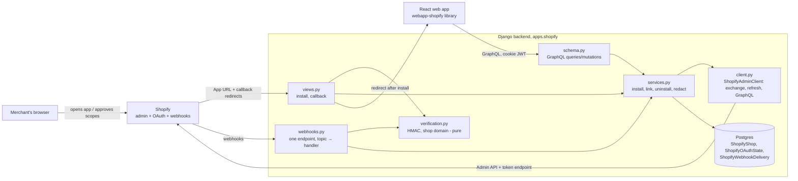
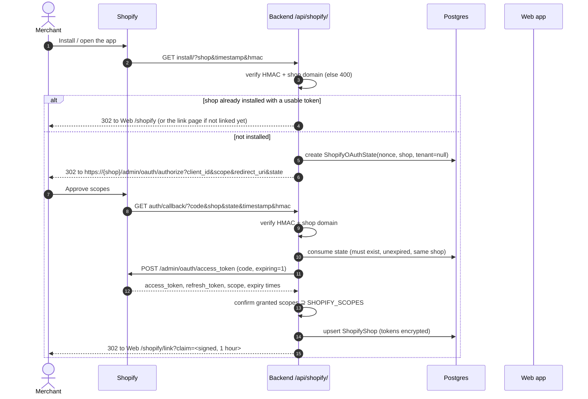
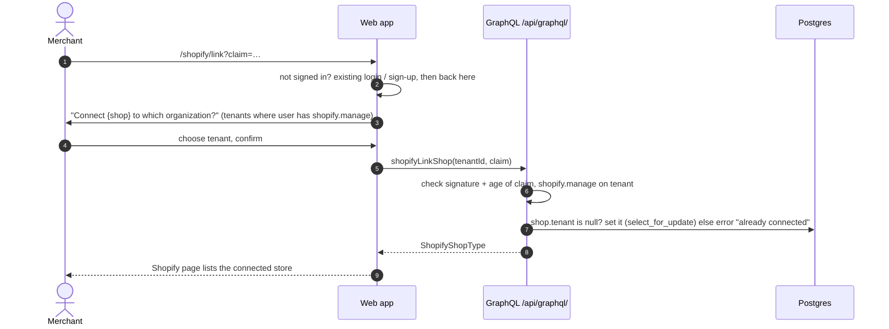
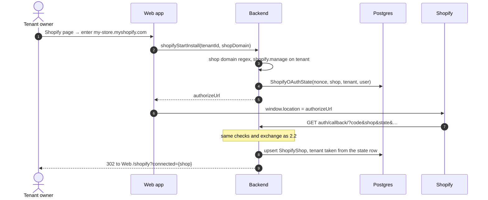
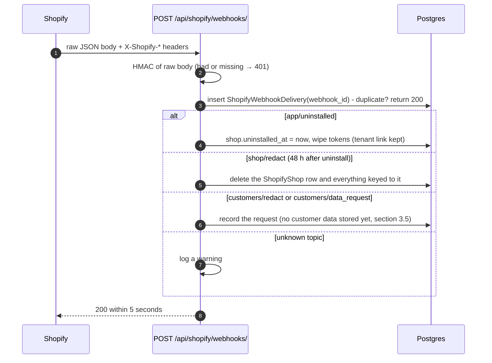
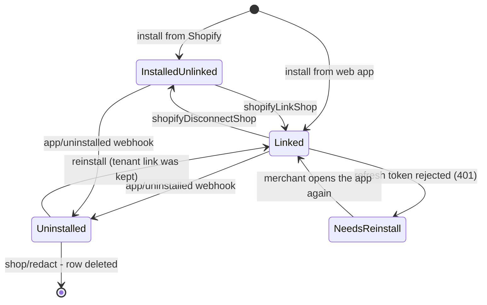

# Shopify App Installation — Implementation Plan

**Date:** 2026-10-03
**Updated:** 2026-10-03 after the human maintainer's first review; 2026-10-07 after the live install
(step 10), which found and fixed the bugs listed in section 5.1, and adding the products page (step 11)
**Status:** Steps 1 to 8 done; step 9 done except its component tests; step 10 done; step 11 (products
page) not started; step 12 (release) not started
**Goal:** Make this SaaS installable as a Shopify app. A merchant installs it on their store, the backend
receives and safely keeps an Admin API access token for that store, the store is linked to one of our
tenants (organizations), and the backend handles the webhooks Shopify requires (uninstall and the three
mandatory privacy compliance topics). Step 11 adds a read-only "Shopify products" page, the first use of
the stored token, to prove the connection works end to end. Other features (orders, product sync,
messaging channels) build on this slice; none of them is in this plan.

---

## 0. Feasibility and approach

**Yes, this is possible, and nothing existing has to be rewritten.** Shopify only needs three things
from us: a URL it opens when a merchant installs or launches the app, a redirect URL that receives the
OAuth code, and HTTPS webhook endpoints. All three are ordinary Django views.

**Approach: one new, self-contained Django app, `apps.shopify`,** built like `apps.payfast`
([`apps/payfast/`](../../../packages/backend/apps/payfast/)): its own settings block, system check,
models, migrations, pure verification functions, an API client, views, GraphQL schema and tests. The only
touches to upstream files are appended lines in the composition points (section 3.1 of
[`agents.md`](../agents.md)):

- [`config/settings.py`](../../../packages/backend/config/settings.py): `"apps.shopify"` in `LOCAL_APPS`, plus a `SHOPIFY_*` settings block
- [`config/urls_api.py`](../../../packages/backend/config/urls_api.py): `path("shopify/", include("apps.shopify.urls"))`
- [`config/schema.py`](../../../packages/backend/config/schema.py): `shopify_schema.Query` / `shopify_schema.Mutation` appended
- [`packages/webapp/src/app/app.component.tsx`](../../../packages/webapp/src/app/app.component.tsx): the new web app routes

The "feature delete" test holds: removing `apps/shopify`, the new web app library and those appended
lines restores the original composition.

### 0.1 What the working Flask app taught us, and what changes

The Flask app at `~/Documents/Projects/Personal/WhatsApp/python/shopify-whatsapp-flask-app` (files
`src/server.py`, `src/helpers.py`, `src/shopify_client.py`) proved the install round trip on a real dev
store. It is a secondary reference: every fact below was re-checked against Shopify's docs (section 1),
and that check found several things the port must do differently.

**Kept from the Flask app**

- The two-endpoint install flow: an "app launched" URL that checks the request and sends the merchant to
  Shopify's authorize page, and an "app installed" redirect URL that checks `state`, exchanges the
  `code` for a token and registers what it needs.
- Query-string HMAC check for Shopify's browser redirects (hex HMAC-SHA256 of the sorted parameters),
  and body HMAC check for webhooks (base64 HMAC-SHA256 of the raw body), both with constant-time compare.
- A plain `requests`-based GraphQL Admin API client instead of an SDK, so every call is visible and
  testable.

**Changed in the port**

1. **Tokens are kept in Postgres, encrypted,** not in an in-memory dict (lost on restart, not shared
   between web workers and Celery). We considered `django-encrypted-model-fields` and
   `django-fernet-fields`, but both are unmaintained (no updates for Django 5.x/6.x). The community
   consensus is to build a small custom wrapper over `cryptography.fernet`. Our `crypto.py` is two
   functions (`encrypt_token`, `decrypt_token`), fully tested, and doesn't add a dependency on an
   abandoned package.
2. **Expiring offline tokens** (`expiring=1`), with refresh. Shopify: "New public apps must use expiring
   offline access tokens", and all public apps must by 1 January 2027 (section 1.3). The Flask app gets a
   non-expiring token.
3. **The shop regex is anchored at both ends.** The Flask `is_valid_shop` uses `re.match` without `$`,
   so `evil.myshopify.com.attacker.example` passes. Shopify says: "Anchor the pattern at both ends."
4. **Granted scopes are confirmed** after the exchange, as Shopify asks.
5. **`state` lives in the database** (bound to a shop, and optionally to a tenant and user), not in a
   cross-site session cookie. The API and the web app are on different hosts here, and section 2's
   "connect from the web app" flow needs `state` tied to a tenant on the server.
6. **API version `2026-10`,** from a setting. The Flask app pins `2025-10`, which is no longer supported:
   Shopify falls forward to the oldest supported version (`2026-01`) for it (section 1.6).
7. **Webhooks come from the app configuration file** (`shopify.app.toml`), not from a per-shop
   `webhookSubscriptionCreate` call. Shopify recommends it, it is the only way to subscribe to the
   compliance topics, and failing app-level subscriptions are not deleted (section 1.5). See decision D3.
8. **Webhook processing is switchable** between synchronous (in the web request) and asynchronous (via
   Celery), controlled by `SHOPIFY_WEBHOOK_DISPATCH`. See section 3.6.
9. **The compliance webhooks are implemented,** not stubbed: wrong HMAC gives `401`, as Shopify requires.
10. **Not embedded (for now).** The Flask app renders a page inside the Shopify admin iframe. This plan
    lands the merchant in our existing React web app instead (decision D1, section 1.7).
11. **ScriptTag calls and `write_script_tags` are dropped.** They aren't needed to install or link a store.

### 0.2 The blog post

https://www.tigersandtacos.dev/posts/create-a-shopify-backend-service-in-python-flask/ (August 2021)
contributes structure rather than code (the post has none beyond configuration):

- **one webhook endpoint with a topic → handler dictionary** (its `webhooks.py`); this plan's
  `apps/shopify/webhooks.py` keeps that shape
- **scopes and webhook topics as named configuration** (its `common/const.py`)
- its own caveat that **slow synchronous webhook handling doesn't scale**, which section 1.5's five-second
  limit makes concrete: our handlers do only quick database work, and anything slow goes to a Celery task

Its env var names (`SHOPIFY_SHARED_SECRET`, `HOSTNAME_FOR_SHOPIFY`) are not reused; section 7 maps the
Flask app's names, which are the ones that actually worked.

---

## 1. Shopify facts we rely on (verified against the docs, 2026-10-03)

Nothing below is from memory. Where the docs are silent, the item says so and becomes a live check in
step 9.

### 1.1 Authorization code grant (install)

Docs: https://shopify.dev/docs/apps/build/authentication-authorization/access-tokens/authorization-code-grant

- Send the merchant to
  `https://{shop}/admin/oauth/authorize?client_id=…&scope=…&redirect_uri=…&state=…` (`grant_options[]=per-user`
  only for online tokens, which we don't use). `redirect_uri` "Must exactly match a redirect URI you've
  configured". `state` is "A randomly generated nonce unique to this request".
- The callback receives `code, hmac, shop, state, timestamp`. Three checks, all required:
  - **state:** "Compare the `state` parameter to the nonce you stored in step 1. If they don't match,
    reject the request."
  - **hmac:** "Remove the `hmac` parameter from the query string, sort the remaining parameters
    alphabetically, and compute an HMAC-SHA256 hash using your client secret", compared in constant time.
  - **shop:** "Confirm the `shop` parameter matches `^[a-zA-Z0-9][a-zA-Z0-9\-]*\.myshopify\.com$`. Anchor
    the pattern at both ends."
- Exchange: `POST https://{shop}/admin/oauth/access_token` with `client_id, client_secret, code` and
  `expiring: '1'`. Response: `access_token, scope, expires_in, refresh_token, refresh_token_expires_in`.
- "Check that `scope` in the response includes all the scopes your app requires." "A `write_*` grant
  includes its matching `read_*` scope."
- Calls carry the header `X-Shopify-Access-Token: {access_token}`.
- **Docs are silent on** the exact parameter encoding used for the hex HMAC when a value contains `&`
  or `%`. The Flask app's `urlencode(sorted(params))` worked on a real store; step 2's test vector and the
  live install (step 9) pin it.

### 1.2 Install also arrives at the App URL

When a merchant installs from the Shopify admin (or "Test on store" in the developer dashboard), Shopify
opens the configured App URL with signed query parameters, which the same HMAC check verifies. The Flask
app's `/app_launched` handled exactly this. Docs on managed installation vs the authorization code grant:
https://shopify.dev/docs/apps/build/authentication-authorization/app-installation. Shopify-managed
installation needs a Shopify CLI app and, for a custom frontend, token exchange (section 1.7), so it is
not used here.

### 1.3 Expiring offline tokens and refresh

Docs: https://shopify.dev/docs/apps/build/authentication-authorization/access-tokens/offline-access-tokens
and https://shopify.dev/docs/apps/build/authentication-authorization/implement-token-exchange#refresh-an-expiring-offline-token

- Lifetimes: access token "1 hour (`expires_in` is `3600`)", refresh token "90 days
  (`refresh_token_expires_in` is `7776000`) when issued".
- "Public apps must use expiring offline access tokens for GraphQL Admin API requests by January 1, 2027."
- Refresh: `POST https://{shop}.myshopify.com/admin/oauth/access_token` with `client_id, client_secret,
grant_type=refresh_token, refresh_token`.
- **Rotation:** "Every refresh returns a new access token and a new refresh token. Store both securely,
  and use the new refresh token in the next refresh request." "The previous access token stays valid
  until its `expires_in` duration ends."
- **Terminal failure:** `401` "This request requires an active refresh_token" covers "an unknown token, a
  token your app has already replaced, an expired token, and a revoked or uninstalled app". "Treat that
  `401` as final: stop retrying". Network errors, timeouts, `5xx` and `429` are "safe to retry with the
  same `refresh_token`".
- Consequence for us: two processes refreshing the same shop at once would race, and the loser's refresh
  token is "already replaced". The refresh therefore runs under a row lock (section 3.3).

### 1.4 Mandatory compliance webhooks

Docs: https://shopify.dev/docs/apps/build/privacy-law-compliance

- Every App Store app must subscribe to `customers/data_request`, `customers/redact` and `shop/redact`,
  in `shopify.app.toml` with `compliance_topics`.
- The app must "respond with a `200` series status code", and "if a mandatory compliance webhook sends a
  request with an invalid Shopify `HMAC` header, then the app must return a `401 Unauthorized` HTTP status."
- `shop/redact` is sent "48 hours after a store owner uninstalls your app". Actions must be completed
  "within 30 days of receiving the request".

### 1.5 Webhook delivery

Docs: https://shopify.dev/docs/apps/build/webhooks/subscribe/https and https://shopify.dev/docs/apps/build/webhooks/subscribe

- Headers: `X-Shopify-Topic`, `X-Shopify-Hmac-SHA256`, `X-Shopify-Shop-Domain`, `X-Shopify-API-Version`,
  `X-Shopify-Webhook-Id`, `X-Shopify-Event-Id`, `X-Shopify-Triggered-At`.
- HMAC: base64 HMAC-SHA256 of the **raw** request body with the client secret.
- "Shopify has a one-second connection timeout and a five-second timeout for the entire request."
  Anything outside 2xx is a failure.
- Retries: "Shopify retries 8 times over the next 4 hours." For subscriptions made through the Admin API,
  "After 8 consecutive failures, the subscription is automatically deleted". App-specific subscriptions
  (`shopify.app.toml`) "will **not** be deleted", and are the recommended way. Compliance topics "Cannot
  be subscribed to using the Admin API".
- Duplicates: "Use X-Shopify-Webhook-Id to deduplicate individual deliveries."

### 1.6 API versions

Docs: https://shopify.dev/docs/api/usage/versioning

- A new version every quarter (January, April, July, October), each "supported for a minimum of 12
  months". Asking for an unsupported version makes Shopify fall forward to "the oldest accessible stable
  version". On 2026-10-03 the supported versions are `2026-01`, `2026-04`, `2026-07` and `2026-10` (latest).

### 1.7 Embedded apps, ID tokens and iframe protection (not built in this plan)

- Embedded apps get a short-lived ID token (formerly "session token") from App Bridge: HS256 with the
  client secret, checks on `exp`, `nbf`, `aud`, `iss`/`dest`; tokens "expire one minute after they're
  issued", and "cannot be used directly with the Admin API"
  (https://shopify.dev/docs/apps/build/authentication-authorization/session-tokens).
- Token exchange trades that ID token for an access token, and needs "A Shopify-managed app installation",
  an embedded app and App Bridge
  (https://shopify.dev/docs/apps/build/authentication-authorization/access-tokens/token-exchange).
- Every embedded HTML response needs `Content-Security-Policy: frame-ancestors https://{shop}
https://admin.shopify.com;`, "different for every shop"
  (https://shopify.dev/docs/apps/build/security/set-up-iframe-protection).
- Why that's out of scope here: our web app signs users in with cookie JWTs, which a cross-site iframe
  can't rely on, and Django's `XFrameOptionsMiddleware` denies framing. Embedding means a second
  authentication path (ID token → our user), so it is a separate future plan (decision D1).
- **App Store listing and embedding (researched 2026-10-03):** Shopify does not strictly prohibit
  non-embedded apps from the App Store. Standalone apps are valid for tools that span multiple platforms
  or need more UI real estate than the admin-chrome width allows. Our app qualifies: it integrates
  Shopify with WhatsApp, making it a multi-platform tool. However, embedded apps get 70–85% higher
  conversion rates, and the "Built for Shopify" certification requires embedded + App Bridge for many
  categories. **Resolution (D1):** ship standalone in this plan to get listed and prove value; plan an
  embedded companion view as a follow-up for "Built for Shopify" certification. The standalone
  architecture doesn't block the listing. See section 9, D1.
  Sources:
  - https://shopify.dev/docs/apps/build/authentication-authorization/session-tokens
  - https://shopify.dev/docs/apps/build/authentication-authorization/access-tokens/token-exchange
  - https://shopify.dev/docs/apps/build/security/set-up-iframe-protection

---

## 2. How it works (diagrams)

The diagrams are Mermaid; GitHub renders them in the browser.

### 2.1 The pieces



### 2.2 Install started from Shopify (App Store, admin, or "Test on store")



### 2.3 Linking a freshly installed store to a tenant



### 2.4 Install started from our web app ("Connect a Shopify store")



### 2.5 Webhooks (uninstall and compliance)



### 2.6 Calling the Admin API with an expiring token

```mermaid
sequenceDiagram
    autonumber
    participant Caller as A service (later features)
    participant SV as services.admin_client_for(shop)
    participant DB as Postgres
    participant Shopify

    Caller->>SV: client for shop
    SV->>DB: read ShopifyShop
    alt access token expires in under 5 minutes
        SV->>DB: BEGIN; SELECT … FOR UPDATE (re-read: another worker may have refreshed)
        SV->>Shopify: POST access_token (grant_type=refresh_token)
        alt 200
            SV->>DB: store new access + refresh tokens and expiries; COMMIT
        else 401 "requires an active refresh_token"
            SV->>DB: mark needs_reinstall; COMMIT
            SV-->>Caller: raise ShopifyReauthorizationRequired
        end
    end
    SV-->>Caller: ShopifyAdminClient(shop, access_token)
    Caller->>Shopify: POST /admin/api/2026-10/graphql.json
```

### 2.7 Data model

```mermaid
erDiagram
    Tenant ||--o{ ShopifyShop : "connects (null until linked)"
    User ||--o{ ShopifyOAuthState : "started (connect-from-web-app only)"
    Tenant ||--o{ ShopifyOAuthState : "bound to (connect-from-web-app only)"
    ShopifyShop ||--o{ ShopifyWebhookDelivery : receives

    ShopifyShop {
        string shop_domain UK "my-store.myshopify.com"
        fk tenant "nullable"
        text access_token_encrypted
        datetime access_token_expires_at
        text refresh_token_encrypted
        datetime refresh_token_expires_at
        string scopes
        datetime installed_at
        datetime uninstalled_at "nullable"
        bool needs_reinstall
    }
    ShopifyOAuthState {
        string nonce UK
        string shop_domain
        fk tenant "nullable"
        fk created_by "nullable"
        datetime created
    }
    ShopifyWebhookDelivery {
        string webhook_id UK
        string topic
        string shop_domain
        json payload
        datetime created
    }
```

### 2.8 A store's lifecycle



---

## 3. Backend design

### 3.1 Settings ([`config/settings.py`](../../../packages/backend/config/settings.py)), additive only

```python
# Shopify app (https://shopify.dev/docs/apps/build). Always defined so apps.shopify imports safely;
# the apps.shopify system check reports missing values only when SHOPIFY_ENABLED.
SHOPIFY_API_KEY = env("SHOPIFY_API_KEY", default="")            # the app's client ID
SHOPIFY_API_SECRET = env("SHOPIFY_API_SECRET", default="")      # the app's client secret (HMAC key too)
SHOPIFY_SCOPES = env.list("SHOPIFY_SCOPES", default=["read_products"])
SHOPIFY_API_VERSION = env("SHOPIFY_API_VERSION", default="2026-10")
# Fernet key for access/refresh tokens at rest; generate like BACKUP_MASTER_KEY above.
SHOPIFY_TOKEN_ENCRYPTION_KEY = env("SHOPIFY_TOKEN_ENCRYPTION_KEY", default="")
# OAuth state nonce lifetime in seconds (how long a merchant has to complete the authorization flow).
SHOPIFY_AUTH_TIMEOUT = env.int("SHOPIFY_AUTH_TIMEOUT", default=600)  # 10 minutes
# Webhook processing dispatch: "sync" (handle in the web request) or "celery" (hand off to a Celery task).
# "sync" is the safe default: it needs no worker and is enough while all handlers are quick DB writes.
# Switch to "celery" when handlers start doing slow work (API calls, syncing products).
SHOPIFY_WEBHOOK_DISPATCH = env("SHOPIFY_WEBHOOK_DISPATCH", default="sync")
SHOPIFY_ENABLED = bool(SHOPIFY_API_KEY and SHOPIFY_API_SECRET)
```

- The OAuth `redirect_uri` is derived, not configured: `f"{API_URL}/api/shopify/auth/callback/"`, from
  the existing `API_URL` setting. After install the merchant is sent to the existing `WEB_APP_URL`. So the
  Flask app's `INSTALL_REDIRECT_URL`, `WEBHOOK_APP_UNINSTALL_URL`, `SERVER_*` and `APP_NAME` need no
  counterparts (section 7).
- **System check** ([`apps/shopify/checks.py`](../../../packages/backend/apps/shopify/checks.py)): when
  `SHOPIFY_ENABLED`, errors for an empty or invalid `SHOPIFY_TOKEN_ENCRYPTION_KEY`, an empty
  `SHOPIFY_SCOPES`, a `SHOPIFY_API_VERSION` not shaped `YYYY-MM` with month 01/04/07/10, and a
  `SHOPIFY_WEBHOOK_DISPATCH` not in `{"sync", "celery"}`. When disabled, every Shopify view returns 404
  and every mutation refuses, as PayFast does on Stripe.
- Each setting gets its `test_<name>_setting_reads_env_var` subprocess test (section 2.3 of
  [`agents.md`](../agents.md)).
- `cryptography` (for Fernet) is today only a transitive dependency. Add it to
  [`pyproject.toml`](../../../packages/backend/pyproject.toml) as a direct dependency pinned `==` to the
  version already in `uv.lock`, so the import doesn't depend on another package's choices.

### 3.2 New app [`packages/backend/apps/shopify/`](../../../packages/backend/apps/shopify/)

```
apps/shopify/
├── __init__.py
├── apps.py              # ShopifyConfig.ready(): register checks
├── checks.py
├── constants.py         # webhook topic names, refresh margin
├── permissions.py       # shopify.view / shopify.manage via register_app_permissions()
├── verification.py      # pure: is_valid_shop_domain, verify_query_hmac, verify_webhook_hmac
├── crypto.py            # pure: encrypt_token / decrypt_token (Fernet, custom, see section 0.1)
├── models.py            # ShopifyShop, ShopifyOAuthState, ShopifyWebhookDelivery
├── migrations/0001_initial.py (+ a data migration for the permissions if the registry needs one)
├── client.py            # ShopifyAdminClient: exchange_code, refresh, graphql
├── services.py          # start_install, complete_install, link_shop, disconnect, admin_client_for,
│                        # handle_uninstalled, handle_shop_redact, handle_customers_*
├── tasks.py             # Celery tasks: process_shopify_webhook (used when SHOPIFY_WEBHOOK_DISPATCH=celery)
├── views.py             # install_view (App URL), callback_view
├── webhooks.py          # webhook_view + TOPIC_HANDLERS dict (the blog's shape) + dispatch logic
├── urls.py              # install/, auth/callback/, webhooks/
├── schema.py            # GraphQL types, queries, mutations
├── admin.py             # read-only admin; never shows tokens
├── management/commands/shopify_seed_demo.py
├── management/commands/shopify_signed_query.py  # for human check 3 (not in production module)
└── tests/
```

Routes, under `/api/shopify/`:

- `GET install/`: the App URL. Rate-limited (section 3.7), HMAC + shop checks, then section 2.2.
- `GET auth/callback/`: the allowed redirect URL. Rate-limited. Sections 2.2 and 2.4.
- `POST webhooks/`: CSRF-exempt, the single webhook URL for every topic. Section 2.5.

### 3.3 Models

```python
class ShopifyShop(TimestampedMixin, models.Model):
    """A store that installed the app. One row per shop domain; tokens are encrypted at rest."""
    shop_domain = models.CharField(max_length=255, unique=True)       # my-store.myshopify.com
    tenant = models.ForeignKey("multitenancy.Tenant", null=True, blank=True,
                               on_delete=models.SET_NULL, related_name="shopify_shops")
    access_token_encrypted = models.TextField(blank=True)
    access_token_expires_at = models.DateTimeField(null=True)
    refresh_token_encrypted = models.TextField(blank=True)
    refresh_token_expires_at = models.DateTimeField(null=True)
    scopes = models.CharField(max_length=1024, blank=True)            # as granted, comma-separated
    installed_at = models.DateTimeField(null=True)
    uninstalled_at = models.DateTimeField(null=True)
    needs_reinstall = models.BooleanField(default=False)

class ShopifyOAuthState(TimestampedMixin, models.Model):
    """The single-use `state` nonce of one authorize redirect (section 1.1)."""
    nonce = models.CharField(max_length=64, unique=True)              # secrets.token_urlsafe(32)
    shop_domain = models.CharField(max_length=255)
    tenant = models.ForeignKey("multitenancy.Tenant", null=True, on_delete=models.CASCADE)
    created_by = models.ForeignKey(settings.AUTH_USER_MODEL, null=True, on_delete=models.CASCADE)

class ShopifyWebhookDelivery(TimestampedMixin, models.Model):
    """One received webhook, keyed by X-Shopify-Webhook-Id for deduplication (section 1.5)."""
    webhook_id = models.CharField(max_length=255, unique=True)
    topic = models.CharField(max_length=128)
    shop_domain = models.CharField(max_length=255, db_index=True)
    payload = models.JSONField()
```

- **State:** consumed with `select_for_update` and deleted on use. Its lifetime is controlled by
  `SHOPIFY_AUTH_TIMEOUT` (default 600 seconds / 10 minutes, configurable via environment variable if
  merchants need more time to review scopes). Must match the callback's `shop`. Expired rows are deleted
  whenever a new one is created, so no beat task is needed.
- **Reinstall** (section 2.8): `complete_install` updates the existing row, clears `uninstalled_at` and
  `needs_reinstall`, and keeps `tenant`, so a merchant who reinstalls finds their store still connected.
- **Refresh** (section 1.3): `admin_client_for(shop)` refreshes when the access token has under 5 minutes
  left, inside `transaction.atomic()` with `select_for_update`, re-reading the row first so two workers
  never spend the same refresh token. Unlike PayFast's case (issue 8 in the PayFast plan), Shopify's token
  endpoint makes no call back to us, so holding the lock during the request can't deadlock; a 10-second
  timeout bounds it.
- **Deleting a tenant** sets `tenant` to null (the store stays installed and can be relinked). Whether it
  should also revoke the install is decision D4.

### 3.4 GraphQL API

```graphql
type ShopifyShopType {
  shopDomain: String!
  scopes: [String!]!
  installedAt: DateTime
  uninstalledAt: DateTime
  needsReinstall: Boolean!
}
type ShopifyClaimType { shopDomain: String! }   # what the link page shows before confirming

type Query {
  shopifyConfig: ShopifyConfigType!                       # { enabled }, AnyoneFullAccess
  shopifyShops(tenantId: ID!): [ShopifyShopType!]!        # shopify.view
  shopifyClaim(claim: String!): ShopifyClaimType          # signed in; checks the claim only
}
type Mutation {
  shopifyStartInstall(input: { tenantId, shopDomain }): { authorizeUrl: String! }   # shopify.manage
  shopifyLinkShop(input: { tenantId, claim }): { shop: ShopifyShopType }           # shopify.manage
  shopifyDisconnectShop(input: { tenantId, shopDomain }): { ok: Boolean! }         # shopify.manage
}
```

- **Privilege (section 3.5 of [`agents.md`](../agents.md)):** a token never leaves the backend through any
  entrypoint. Connecting and disconnecting stores needs a new `shopify.manage` permission, viewing needs
  `shopify.view`, both registered from `apps/shopify/permissions.py` through the existing registry
  ([`apps/multitenancy/permissions.py`](../../../packages/backend/apps/multitenancy/permissions.py)) and
  given to the OWNER and ADMIN system roles. The MCP server gets no Shopify capability in this plan.
- **The claim** is `django.core.signing.TimestampSigner` over the shop's id, valid 1 hour, usable only
  while the shop has no tenant. Anyone holding a live claim could connect that store to their own tenant,
  so it's short-lived, single-effect, and only ever sent in a redirect to our own `WEB_APP_URL`.
- Use `log_action(...)` for link and disconnect, as the finance mutations do, with a new
  `ActionEntityType` value appended (`SHOPIFY_SHOP`), a touch to
  [`apps/multitenancy/constants.py`](../../../packages/backend/apps/multitenancy/constants.py) to flag.
- Regenerate the committed schema and types afterwards:
  `pnpm nx run webapp-api-client:graphql:download-schema`.

### 3.5 Webhook handlers ([`webhooks.py`](../../../packages/backend/apps/shopify/webhooks.py))

```python
TOPIC_HANDLERS = {
    "app/uninstalled": services.handle_uninstalled,
    "shop/redact": services.handle_shop_redact,
    "customers/redact": services.handle_customers_redact,
    "customers/data_request": services.handle_customers_data_request,
}
```

- Order inside the view: HMAC of `request.body` (missing or wrong → `401`, required for compliance
  topics), then insert `ShopifyWebhookDelivery` (an `IntegrityError` on `webhook_id` means a repeat →
  `200`), then dispatch the handler (section 3.6), then `200`. An unknown topic is logged and answered
  `200`, so Shopify doesn't retry something we'll never handle.
- **Customer data:** this slice stores no customer data, so the two `customers/*` handlers record the
  request and do nothing else. The first feature that stores customer data must make them real; a test
  asserts they exist so that's hard to forget.
- **`shop/redact` and the audit trail.** Shopify requires that a redact "remove all personal data" within
  30 days. We comply, but keep a tombstone: the `ShopifyShop` row is anonymized (`shop_domain` replaced
  with a hash, tokens wiped, tenant nulled) and `ShopifyWebhookDelivery` payloads for that shop are
  replaced with `{}`. The rows remain so we have a structural audit trail ("a redact happened for row N on
  date D") without keeping any personal or shop data. The delivery row the `shop/redact` handler itself
  wrote is also redacted in the same transaction.
- All handlers are quick single-row database writes, well inside the five-second limit (section 1.5).

### 3.6 Webhook dispatch ([`webhooks.py`](../../../packages/backend/apps/shopify/webhooks.py) and [`tasks.py`](../../../packages/backend/apps/shopify/tasks.py))

Controlled by `SHOPIFY_WEBHOOK_DISPATCH` (section 3.1):

| Value            | Behaviour                                                                                                                                                                                  | When to use                                                                                          |
| ---------------- | ------------------------------------------------------------------------------------------------------------------------------------------------------------------------------------------ | ---------------------------------------------------------------------------------------------------- |
| `sync` (default) | The handler runs inline in the web request, inside the 5-second window.                                                                                                                    | All current handlers are single-row DB writes; this is the simplest deployment (no worker required). |
| `celery`         | The view records the delivery, returns `200` immediately, and enqueues `process_shopify_webhook.delay(webhook_delivery_id)`. The Celery task loads the delivery row and calls the handler. | When later features add slow handlers (API calls, product sync). Requires a running Celery worker.   |

Both paths share the same `TOPIC_HANDLERS` dict and the same handler functions; only the call site
differs. This follows the existing `TASK_BACKEND` pattern
([`common/task_backends/`](../../../packages/backend/common/task_backends/__init__.py)) but is scoped
to Shopify webhooks. The system check (section 3.1) errors if the value is not `sync` or `celery`.

```python
# apps/shopify/tasks.py
from config.celery import app as celery_app

@celery_app.task(bind=True, max_retries=3, default_retry_delay=60)
def process_shopify_webhook(self, webhook_delivery_id: int) -> None:
    """Process a Shopify webhook asynchronously. Called when SHOPIFY_WEBHOOK_DISPATCH=celery."""
    delivery = ShopifyWebhookDelivery.objects.get(id=webhook_delivery_id)
    handler = TOPIC_HANDLERS.get(delivery.topic)
    if handler:
        handler(delivery.shop_domain, delivery.payload)
```

### 3.7 Rate limiting on install and callback views

The `install/` and `auth/callback/` views are public-facing and unauthenticated. An attacker can't forge
a valid HMAC, but can still hammer the endpoints with invalid signatures, creating CPU load from HMAC
computation and database lookups.

**Approach:** use `django-ratelimit` (decorator-based, works with standard Django views, backed by
Django's cache framework). The project already has Redis via `REDIS_CONNECTION`; we configure a Django
cache alias `"ratelimit"` pointing at it (or fall back to `LocMemCache` in tests).

```python
# apps/shopify/views.py
from django_ratelimit.decorators import ratelimit

@ratelimit(key='ip', rate='30/m', block=True)   # 30 requests per minute per IP
def install_view(request): ...

@ratelimit(key='ip', rate='30/m', block=True)
def callback_view(request): ...

# webhooks/ is NOT rate-limited: Shopify retries on failure and we must always accept valid deliveries.
```

- `django-ratelimit` is added to `pyproject.toml` pinned `==` to the resolved version.
- A `"ratelimit"` cache alias is added to `CACHES` in `config/settings.py`, using the existing
  `REDIS_CONNECTION`. Tests override it with `LocMemCache`.
- Rate-limited views return `429 Too Many Requests` when the limit is exceeded. The HMAC check still
  runs for requests that pass the rate limit.
- The webhook endpoint is NOT rate-limited: Shopify retries failed deliveries up to 8 times, and we
  must always accept valid ones.

### 3.8 Shopify app configuration ([`shopify.app.toml.example`](../../../packages/backend/apps/shopify/shopify.app.toml.example))

A committed template with placeholders only. The human maintainer copies it, fills `client_id` and the
public URLs, and pushes it with `shopify app deploy`. It holds:

```toml
client_id = "<SHOPIFY_API_KEY>"
name = "<app name>"
application_url = "https://<api-host>/api/shopify/install/"
embedded = false

[access_scopes]
scopes = "read_products"

[auth]
redirect_urls = ["https://<api-host>/api/shopify/auth/callback/"]

[webhooks]
api_version = "2026-10"

  [[webhooks.subscriptions]]
  topics = ["app/uninstalled"]
  uri = "https://<api-host>/api/shopify/webhooks/"

  [[webhooks.subscriptions]]
  compliance_topics = ["customers/data_request", "customers/redact", "shop/redact"]
  uri = "https://<api-host>/api/shopify/webhooks/"
```

The keys come from the docs' examples in section 1.4. The exact key set the current CLI accepts
(`embedded`, `[auth]`, `[access_scopes]`) is not quoted in section 1 and is checked in step 8 against
https://shopify.dev/docs/apps/build/cli-for-apps/app-configuration before the file is committed.

---

## 4. Frontend design (new library `packages/webapp-libs/webapp-shopify`)

A new Nx library, shaped like
[`webapp-crud-demo`](../../../packages/webapp-libs/webapp-crud-demo/), imported through its public entry
point:

```
webapp-shopify/src/
├── graphql/
│   ├── shopifyConfig.query.graphql.ts
│   ├── shopifyShops.query.graphql.ts
│   ├── shopifyClaim.query.graphql.ts
│   ├── shopifyStartInstall.mutation.graphql.ts
│   ├── shopifyLinkShop.mutation.graphql.ts
│   └── shopifyDisconnectShop.mutation.graphql.ts
├── routes/
│   ├── shopifyShops.component.tsx
│   ├── shopifyShops.component.test.tsx
│   ├── shopifyLink.component.tsx
│   └── shopifyLink.component.test.tsx
├── config/routes.ts                # shopify: 'shopify', shopifyLink: 'shopify/link'
└── index.ts                        # public entry point
```

- Routes are registered in [`app.component.tsx`](../../../packages/webapp/src/app/app.component.tsx)
  (append only). The link page sits behind the existing auth guard, so a signed-out merchant goes through
  the normal login or sign-up and returns to the same URL.
- A sidebar entry, shown only when `shopifyConfig.enabled` and the user has `shopify.view`.

### 4.1 GraphQL documents

Each document maps to one query or mutation from section 3.4:

```graphql
# shopifyConfig.query.graphql.ts
query shopifyConfigQuery {
  shopifyConfig {
    enabled
  }
}

# shopifyShops.query.graphql.ts
query shopifyShopsQuery($tenantId: ID!) {
  shopifyShops(tenantId: $tenantId) {
    shopDomain
    scopes
    installedAt
    uninstalledAt
    needsReinstall
  }
}

# shopifyClaim.query.graphql.ts
query shopifyClaimQuery($claim: String!) {
  shopifyClaim(claim: $claim) {
    shopDomain
  }
}

# shopifyStartInstall.mutation.graphql.ts
mutation shopifyStartInstallMutation($input: ShopifyStartInstallInput!) {
  shopifyStartInstall(input: $input) {
    authorizeUrl
  }
}

# shopifyLinkShop.mutation.graphql.ts
mutation shopifyLinkShopMutation($input: ShopifyLinkShopInput!) {
  shopifyLinkShop(input: $input) {
    shop {
      shopDomain
      scopes
      installedAt
    }
  }
}

# shopifyDisconnectShop.mutation.graphql.ts
mutation shopifyDisconnectShopMutation($input: ShopifyDisconnectShopInput!) {
  shopifyDisconnectShop(input: $input) {
    ok
  }
}
```

### 4.2 Component test scenarios (Jest / RTL with mocked Apollo)

**`shopifyShops.component.test.tsx`:**

| Scenario                 | Mock response                                                     | Expected behaviour                                                              |
| ------------------------ | ----------------------------------------------------------------- | ------------------------------------------------------------------------------- |
| Config disabled          | `shopifyConfig.enabled = false`                                   | "Shopify integration is not configured" message                                 |
| Empty state              | `shopifyShops = []`                                               | "No stores connected" + "Connect a store" form visible                          |
| Seeded data              | `shopifyShops` returns linked, uninstalled, needs-reinstall shops | Each row shows correct badge (active / uninstalled / needs reinstall)           |
| Start install happy path | User enters `my-store.myshopify.com`, submits                     | `shopifyStartInstall` mutation fires, `window.location` set to `authorizeUrl`   |
| Invalid domain           | User enters `not-a-shop.example`                                  | Client-side validation error, no mutation fired                                 |
| Disconnect               | User clicks Disconnect on a shop                                  | Confirmation dialog → `shopifyDisconnectShop` mutation → shop removed from list |
| Permission denied        | `shopifyShops` returns GraphQL permission error                   | Error banner, no data shown                                                     |

**`shopifyLink.component.test.tsx`:**

| Scenario                   | Mock response                                                    | Expected behaviour                                                |
| -------------------------- | ---------------------------------------------------------------- | ----------------------------------------------------------------- |
| Happy path                 | `shopifyClaim` returns `shopDomain`, user picks tenant, confirms | `shopifyLinkShop` fires → success banner → redirect to `/shopify` |
| Expired claim              | `shopifyClaim` returns null / error                              | "This link has expired" message, link to Shopify page             |
| Already connected          | `shopifyLinkShop` returns "already connected" error              | Error banner with shop domain                                     |
| No tenants with permission | User has no tenant where they have `shopify.manage`              | "You don't have permission" message                               |
| Not signed in              | No auth cookie                                                   | Redirect to login, then back to `/shopify/link?claim=...`         |

---

## 5. Proposed Changes (implementation steps)

Branch: `feat/shopify-app-installation` off `master`. Every step is strict TDD (section 2 of
[`agents.md`](../agents.md)): write the tests listed first, see RED, then write the production files.

1. ✅ **Settings, system check, app skeleton, and rate-limit infrastructure.**
   - Tests first: `apps/shopify/tests/test_settings.py` (one subprocess test per setting, including
     `SHOPIFY_AUTH_TIMEOUT` and `SHOPIFY_WEBHOOK_DISPATCH`),
     `test_checks.py` (enabled without key → error; bad version → error; bad dispatch value → error;
     disabled → no errors).
   - Then: the settings block, `apps.py`, `checks.py`, `LOCAL_APPS` entry, `cryptography` pin,
     `django-ratelimit` pin, `CACHES["ratelimit"]` alias in `config/settings.py`.
2. ✅ **Verification functions** (pure, no Django).
   - Tests first: `test_verification.py`. Known-good query HMAC (vector built in the test with `hmac` and
     a fixed secret, plus one real callback query captured during step 10 and added afterwards, with the
     secret replaced); tampered value; missing `hmac`; the anchored shop regex, including
     `evil.myshopify.com.attacker.example`, uppercase, a trailing slash; webhook HMAC on raw bytes,
     including a body whose JSON re-serialization would differ.
   - Then: `verification.py`.
3. ✅ **Token encryption and models.**
   - Tests first: `test_crypto.py` (round trip; wrong key fails loudly), `test_models.py` (unique domain,
     tenant nulled on tenant delete, token properties never return ciphertext).
   - Then: `crypto.py`, `models.py`, `0001_initial`.
4. ✅ **Admin API client.**
   - Tests first: `test_client.py` with `requests` mocked through pytest-mock: `exchange_code` sends
     `expiring=1` and returns the five fields; `refresh` sends `grant_type=refresh_token`; a `401`
     refresh raises `ShopifyRefreshTokenRejected`; a `5xx`/timeout raises a retryable error; `graphql`
     posts to `/admin/api/{SHOPIFY_API_VERSION}/graphql.json` with the token header and surfaces `errors`.
   - Then: `client.py`.
5. ✅ **Install and callback views (rate-limited), plus seed data.**
   - Tests first: `test_services_install.py` (state creation, single use, expiry via `SHOPIFY_AUTH_TIMEOUT`,
     shop mismatch; scope confirmation; reinstall keeps the tenant), `test_views.py` (bad HMAC → 400,
     bad shop → 400, new shop → 302 to Shopify authorize with every parameter, installed shop → 302 to
     web app, callback happy path → 302 to link page with a claim, web-app-started callback → linked to
     the state's tenant; disabled → 404; rate limit exceeded → 429).
   - Then: `services.py` (install part), `views.py` (with `@ratelimit` decorators), `urls.py`, the
     `config/urls_api.py` line, `shopify_signed_query` management command, and `shopify_seed_demo`
     (section 6), because the routes are now reachable.
6. ✅ **Linking, GraphQL and permissions.**
   - Tests first: `test_schema.py`: `shopifyShops` needs `shopify.view`; a MEMBER without
     `shopify.manage` can't start, link or disconnect; claim expired / tampered / already used;
     `authorizeUrl` content; no field exposes a token.
   - Then: `permissions.py`, `schema.py`, the `config/schema.py` lines, the `ActionEntityType` value,
     schema regeneration.
7. ✅ **Webhooks (sync and Celery dispatch).**
   - Tests first: `test_webhooks.py`: wrong/missing HMAC → 401 for every topic; duplicate
     `X-Shopify-Webhook-Id` → 200 and no second effect; `app/uninstalled` wipes tokens and keeps the
     tenant; `shop/redact` anonymizes the shop and redacts delivery payloads (tombstone, see section 3.5);
     both `customers/*` topics answer 200 and record; unknown topic → 200 plus a warning; GET → 405.
     `test_tasks.py`: `process_shopify_webhook` Celery task calls the handler; missing delivery → logged
     and no crash. `test_webhooks_dispatch.py`: with `SHOPIFY_WEBHOOK_DISPATCH=sync` handler runs inline;
     with `=celery` handler is enqueued as a Celery task.
   - Then: `webhooks.py`, `tasks.py`, the handler functions in `services.py`.
8. ✅ **Token refresh path and app configuration template.**
   - Tests first: `test_services_refresh.py` (frozen time): fresh token → no refresh; under 5 minutes →
     refresh and both tokens rotated; `401` → `needs_reinstall` and `ShopifyReauthorizationRequired`;
     transient error leaves the stored refresh token untouched.
   - Then: `admin_client_for`, `shopify.app.toml.example` (after checking the CLI reference, section 3.8).
9. ⚠️ **Frontend library.** Production code done; **the component tests were never written.**
   `webapp-shopify` has no test files, so nothing automated covers the two pages. That gap is how the
   blank screens in section 5.1 reached the browser.
   - Tests first: the scenarios in section 4.2, one test file per component. **Still to do**, before
     step 11's frontend work.
   - Then: the GraphQL documents (section 4.1), the `shopifyShops` and `shopifyLink` components, routes,
     sidebar entry, and the `webapp-shopify` Nx library wiring (`project.json`, `tsconfig`, `index.ts`).
10. ✅ **Live install on a development store.** Done 2026-10-07: installed from Shopify, linked to an
    organization, store listed as Active (checks 9 and 14 to 16). Checks 10 to 13 not yet run. The two
    things section 1 leaves open (HMAC encoding of special characters; the CLI's accepted config keys)
    are still unrecorded. Bugs found on the way are in section 5.1.
11. **Products page** (added 2026-10-07; design in section 5.2).
    - Tests first: `apps/shopify/tests/test_products.py` (section 5.2 lists the cases), then
      `shopifyProducts.component.spec.tsx` with mocked Apollo.
    - Then: `products.py` (the Admin API query and mapping), the `shopifyProducts` field in `schema.py`,
      schema regeneration, the `shopifyProducts` GraphQL document, the page component, its route and the
      sidebar entry. Run the checks 17 to 21 after.
12. **Release bookkeeping.** `CHANGELOG.md` entry and version bump (section 10).

### 5.1 Bugs found during the live install (2026-10-07), all fixed

Each one stopped the flow in the browser even though the backend tests passed. Listed so the same
mistakes aren't repeated in step 11.

| #   | Symptom                                                                | Cause                                                                                                                                                                                                         | Fix                                                                                                                                                                                                                                                                                                        |
| --- | ---------------------------------------------------------------------- | ------------------------------------------------------------------------------------------------------------------------------------------------------------------------------------------------------------- | ---------------------------------------------------------------------------------------------------------------------------------------------------------------------------------------------------------------------------------------------------------------------------------------------------------- |
| 1   | Blank page at `/shopify/link?claim=…`                                  | The optional `:lang` route read `shopify` as a locale, and the locale redirect dropped the query string                                                                                                       | [`validRoutesProviders.tsx`](../../../packages/webapp/src/app/providers/validRoutesProvider/validRoutesProviders.tsx) accepts only real locale codes; the redirect keeps the path and query ([`withLocale.ts`](../../../packages/webapp/src/app/providers/validRoutesProvider/withLocale.ts), with a test) |
| 2   | Blank page: `@apollo/client` has no export `useMutation`               | Apollo Client 4 moved the React hooks                                                                                                                                                                         | Import hooks from `@apollo/client/react` in both pages                                                                                                                                                                                                                                                     |
| 3   | Blank page after that                                                  | `asyncComponent` (`React.lazy`) needs a default export; the page folders had only named exports                                                                                                               | `export { X as default }` in each page's `index.ts`, like the other libraries                                                                                                                                                                                                                              |
| 4   | `lucide-react` not found; lint and type-check broken                   | `pnpm-lock.yaml` recorded the library at a non-existent nested path, so its dependencies were never installed; the lint config came from a different generator; `tsconfig.lib.json` left out `@types/gtag.js` | `pnpm install`; lint config reuses webapp-core's; `@types/gtag.js` added                                                                                                                                                                                                                                   |
| 5   | `permission_denied` on Connect                                         | `shopify.view` / `shopify.manage` were registered in code but never written to the database, which permission checks read. The tests hid it by inserting the permissions by hand                              | Data migration [`0003_seed_shopify_permissions`](../../../packages/backend/apps/shopify/migrations/0003_seed_shopify_permissions.py) creates the rows and backfills existing organizations' roles; `test_permissions.py`                                                                                   |
| 6   | (would have) blank page after linking, and on reopening a linked store | Redirects to `/shopify` without the tenant id; the tenant route read `shopify` as the tenant                                                                                                                  | Link page uses `useGenerateTenantPath`; backend redirects to `/<tenant global id>/shopify` (`_redirect_to_shops_list`, tested)                                                                                                                                                                             |
| 7   | Reopening the app landed on the dashboard, not the Shopify page        | The locale redirect rebuilt the path from route params; nested splat routes overwrite `params['*']`, so `shopify` was lost                                                                                    | Same fix as row 1: prefix the full `location.pathname`                                                                                                                                                                                                                                                     |
| 8   | Type errors for `shopify.view` in the web app                          | The frontend `PermissionCode` union didn't list the Shopify codes                                                                                                                                             | Added to [`usePermissionCheck.hook.ts`](../../../packages/webapp-libs/webapp-tenants/src/hooks/usePermissionCheck/usePermissionCheck.hook.ts)                                                                                                                                                              |

Lessons that apply to every later step:

- Write the component tests (step 9's gap): a render test per page would have caught rows 2, 3 and 6.
- A new permission needs a data migration, not just a `permissions.py` entry. The only command that helps
  is `makemigrations <app> --empty --name <name>`; the body follows
  [`apps/backup/migrations/0001_initial.py`](../../../packages/backend/apps/backup/migrations/0001_initial.py).
  Tests must not grant permissions by hand where the point is that the role has them.
- `graphql:download-schema` also refreshes the live Contentful schema. Keep only the `api.graphql`
  changes (restore `contentful.graphql`), then run `webapp-api-client:graphql:generate-types`.
- While `pnpm saas up` is running, use `docker compose exec backend …`; `docker compose run` recreates
  the `db` container, and a request that lands during the restart fails.
- Run `docker compose run` with `--user "$(id -u):$(id -g)"` when it writes files (migrations), or the
  files end up owned by root.

### 5.2 Products page (step 11)

A read-only list of a connected store's products, fetched live from the Admin API on each page view.
Nothing is stored; no sync, no webhooks. It exists to prove the stored token works, and to give later
features (WhatsApp product messages) a tested way to read products.

Shopify facts to check against the docs at the start of the step, as section 1 did (the API version is
`SHOPIFY_API_VERSION`):

- The Admin GraphQL `products(first:, after:, last:, before:)` connection, with `pageInfo { hasNextPage
hasPreviousPage startCursor endCursor }`. Cursor pagination only: there are no page numbers or totals.
- Which field holds the main image in this API version (`featuredMedia` with a preview image, or the
  older `featuredImage`), plus `title`, `status`, `handle` and the price range.
- Query cost limits and the `THROTTLED` error, so a throttled call shows a "try again" message instead of
  failing.

Backend:

- `apps/shopify/products.py`: `fetch_products(shop, first, after=None, before=None)` builds the query,
  calls `admin_client_for(shop).graphql(...)` (which refreshes the token), and maps the result to plain
  dicts. No Shopify field names leak past this module.
- `schema.py`: `shopifyProducts(tenantId, shopDomain, first, after, before)` returning
  `{ products { id title imageUrl imageAlt status priceMin priceMax currencyCode } pageInfo { … } }`.
  Guarded by `IsTenantMemberAccess` and `shopify.view`. `first` is capped at 50.
- The shop must belong to the tenant in the request; anything else gives the same "not found" as a
  missing shop.

`test_products.py` cases (the Admin API mocked with pytest-mock, as `test_client.py` does):

1. A page of products is mapped to the GraphQL shape, image and price included.
2. A product without an image gives `imageUrl: null`, not an error.
3. `after` and `before` are passed through; `pageInfo` comes back unchanged.
4. `first` above 50 is capped.
5. A member without `shopify.view` is refused.
6. A shop linked to another tenant is "not found" (cross-tenant isolation).
7. An uninstalled shop, or one with `needs_reinstall`, gives a clear "reconnect the store" error and
   makes no API call.
8. A refresh token Shopify rejects marks the shop `needs_reinstall` (the existing path in
   `admin_client_for`) and gives the same error.
9. A `THROTTLED` response gives a "try again shortly" error.
10. No token appears in the response or the error messages.

Frontend (`webapp-shopify`):

- Route `shopify/products` under the tenant prefix, with `shopify.view`, and a sidebar entry
  "Shopify products" next to "Shopify".
- A store picker when the organization has more than one active store; hidden when it has one; a "no
  stores connected" message with a link to the Shopify page when it has none.
- A grid of cards (image, title, price, status), 12 per page, with Previous and Next buttons driven by
  `pageInfo` (keep the current cursor in the URL query, so refresh and the back button work).
- Loading, empty ("this store has no products") and error states, the reconnect error linking to the
  Shopify page.
- `shopifyProducts.component.spec.tsx`: renders a page of products; Next requests the next cursor;
  Previous is disabled on the first page; the empty and reconnect states; the store picker switches
  stores.

Size: about the same as step 9, six to eight RED/GREEN cycles. Do step 9's missing component tests
first, so the products page follows a tested pattern.

---

## 6. Seed data (`shopify_seed_demo`)

Idempotent, refuses to run when `ENVIRONMENT_NAME=production`, fixed ids/domains so the human checks can
be pasted as written. Run with
`docker compose run --rm backend python manage.py shopify_seed_demo --email <your email>`; it uses the
first tenant that user owns.

- `linked-demo.myshopify.com`: linked to that tenant, valid (fake, encrypted) tokens
- `unlinked-demo.myshopify.com`: installed, no tenant; the command prints a fresh claim URL for it
- `uninstalled-demo.myshopify.com`: linked, `uninstalled_at` set, tokens wiped
- `reinstall-demo.myshopify.com`: linked, `needs_reinstall=True`

---

## 7. Environment variables

The Flask app's `.env` maps onto this app as follows (values are never copied into the repository;
they go in the untracked `packages/backend/.env`):

- `SHOPIFY_API_KEY` → `SHOPIFY_API_KEY` (same name)
- `SHOPIFY_SECRET` → `SHOPIFY_API_SECRET`
- `INSTALL_REDIRECT_URL` → not needed: derived from `API_URL` (section 3.1)
- `WEBHOOK_APP_UNINSTALL_URL` → not needed: set in `shopify.app.toml` (section 3.8)
- `SERVER_HOSTNAME`, `SERVER_BASE_URL` → the existing `API_URL`, set to the ngrok URL while testing
- `APP_NAME` → not needed: after install we redirect to `WEB_APP_URL`, not into the Shopify admin
- `FLASK_SECRET_KEY` → the existing `DJANGO_SECRET_KEY` (signs the link claim)
- new: `SHOPIFY_SCOPES`, `SHOPIFY_API_VERSION`, `SHOPIFY_TOKEN_ENCRYPTION_KEY`, `SHOPIFY_AUTH_TIMEOUT`,
  `SHOPIFY_WEBHOOK_DISPATCH`

```bash
# packages/backend/.env (untracked)
SHOPIFY_API_KEY=<client id from the app's dashboard>
SHOPIFY_API_SECRET=<client secret>
SHOPIFY_TOKEN_ENCRYPTION_KEY=<python -c "from cryptography.fernet import Fernet; print(Fernet.generate_key().decode())">
# Optional, code defaults shown
SHOPIFY_SCOPES=read_products
SHOPIFY_API_VERSION=2026-10
SHOPIFY_AUTH_TIMEOUT=600
SHOPIFY_WEBHOOK_DISPATCH=sync
# Existing settings that must point at the public tunnel while testing with a real store
API_URL=https://<your-tunnel>.ngrok-free.app
```

[`packages/backend/.env.shared`](../../../packages/backend/.env.shared) gets the same block commented
out with placeholders. [`.test.env`](../../../packages/backend/.test.env) needs nothing: tests use
`override_settings` (and `.test.env` must not gain comment lines, section 1.3 of
[`agents.md`](../agents.md)). The Flask app's ngrok domain can be reused, pointed at the backend's port
instead of 5000.

---

## 8. Risks

- **Leaked tokens.** Encrypted at rest with a key that's not in the database; never in GraphQL, the
  admin or logs. A test asserts the GraphQL schema has no token field.
- **Forged install or webhook.** HMAC on every Shopify request, anchored shop regex, single-use DB state.
- **Brute-force on install/callback.** Rate-limited to 30 req/min per IP (section 3.7).
- **Claim interception** (someone else connects a merchant's store). One-hour claim, only while
  unlinked, only redirected to our own web app, and disconnect is always possible.
- **Refresh race between workers.** Row lock plus re-read (section 3.3).
- **Webhook subscriptions silently deleted.** Avoided by app-level subscriptions in `shopify.app.toml`
  (section 1.5).
- **API version drift.** A setting with a system check; bump it each year when Shopify's support window
  moves (section 1.6).
- **Forgetting customer-data compliance later.** `customers/*` handlers exist from day one with a test.
- **Audit trail loss on shop/redact.** Tombstone approach preserves structural records while deleting
  all personal/shop data (section 3.5).

---

## 9. Decisions (resolved 2026-10-03)

- **D1. Embedded or standalone admin? → Standalone now, embedded later (hybrid).** The goal is to list
  on the Shopify App Store. Research (section 1.7) confirmed standalone apps are permitted, especially
  for multi-platform tools (ours integrates Shopify + WhatsApp). Embedded apps get higher conversion and
  are required for "Built for Shopify" certification in many categories, so a follow-up plan will add an
  embedded companion view with App Bridge + session tokens. This plan ships `embedded = false`.
- **D2. One store per tenant, or many? → Many** (a plain foreign key). It costs one list in the UI and
  suits agencies running several stores.
- **D3. Webhooks in `shopify.app.toml` or registered per shop on install? → The toml file.** Shopify's
  recommendation, required for compliance topics anyway, not auto-deleted. The cost is installing the
  Shopify CLI to deploy configuration changes.
- **D4. Deleting a tenant: just unlink, or also uninstall the app from the store? → Just unlink.** The
  store stays installed and can be relinked. Uninstalling a merchant's app on their behalf is a bigger
  privilege to grant.
- **D5. Ship the frontend library in the same PR, or backend first? → Same PR,** so the slice is usable
  end to end and the human checks run in the browser.
- **D6. Default scopes. → `read_products` only;** later features add scopes in their own plans
  (merchants approve new scopes on next open, per section 1.2's install doc).
- **D7. How do new permissions reach the database? → A hand-written data migration per app** (decided
  2026-10-07), the convention the backup and multitenancy apps already follow. Rejected: a `post_migrate`
  hook that syncs every registered permission, and a `sync_permissions` command. Both would remove the
  per-app migration, but they're a new mechanism next to upstream's RBAC code.
- **D8. Products page: live or synced? → Live, read-only** (2026-10-07). Each view calls the Admin API;
  nothing is stored. Syncing products into our database is a separate feature with its own plan.

---

## 10. File Summary

New:

- `packages/backend/apps/shopify/` (section 3.2), with its tests, `tasks.py` and `shopify.app.toml.example`
- `packages/webapp-libs/webapp-shopify/` (section 4)

Appended lines in existing files (flagged as touches to original files):

- [`config/settings.py`](../../../packages/backend/config/settings.py): `LOCAL_APPS` entry, `SHOPIFY_*` block, `CACHES["ratelimit"]` alias
- [`config/urls_api.py`](../../../packages/backend/config/urls_api.py): one `path`
- [`config/schema.py`](../../../packages/backend/config/schema.py): Query and Mutation entries
- [`apps/multitenancy/constants.py`](../../../packages/backend/apps/multitenancy/constants.py): `ActionEntityType.SHOPIFY_SHOP`
- [`pyproject.toml`](../../../packages/backend/pyproject.toml) and `uv.lock`: `cryptography==<locked version>`, `django-ratelimit==<version>`
- [`.env.shared`](../../../packages/backend/.env.shared): commented Shopify block
- [`app.component.tsx`](../../../packages/webapp/src/app/app.component.tsx): routes; the sidebar file: one entry
- [`api.graphql`](../../../packages/webapp-libs/webapp-api-client/graphql/schema/api.graphql) and generated types
- `CHANGELOG.md` and the `package.json` versions bumped by `standard-version`
- `pnpm-lock.yaml`, `nx.json`, `package.json` and `tsconfig.base.json`: the `webapp-shopify` library wiring

Changes to original files beyond appended lines, from the live-install fixes (section 5.1):

- [`usePermissionCheck.hook.ts`](../../../packages/webapp-libs/webapp-tenants/src/hooks/usePermissionCheck/usePermissionCheck.hook.ts):
  `'shopify.view' | 'shopify.manage'` added to `PermissionCode` (additive)
- [`validRoutesProviders.tsx`](../../../packages/webapp/src/app/providers/validRoutesProvider/validRoutesProviders.tsx):
  **rewritten locale redirect** (not additive). It now accepts only real locale codes and prefixes the
  full path through the new `withLocale.ts`. Upstream's `useLanguageFromParams()` call was removed, and
  that hook's folder is now unused: restore the call or delete the folder before committing. Expect a
  conflict here on the next `upstream/master` merge.
- [`apps/payfast/tests/test_admin.py`](../../../packages/backend/apps/payfast/tests/test_admin.py)
  (fork code): plain static storage for admin page tests, so they don't need `collectstatic`

Not part of this feature, so leave them out of the commit: the `black` quote rewrites the local test run
makes in `apps/backup`, `apps/sso`, `apps/users`, `common/` and `multitenancy/permissions.py`, and the
Contentful schema refresh.

Release: a new feature with no change to existing behaviour, so a **minor** bump is proposed: **6.1.0**,
under `### Features` (`feat(shopify): install the app on Shopify stores and link them to tenants`). The
human maintainer picks the number.

---

## 11. Verification Plan

### Automated

- RED per test file: `docker compose run --rm -T backend pytest apps/shopify/tests/<file> -v`
  (check `DATABASE_URL` first, section 1.3 of [`agents.md`](../agents.md)).
- GREEN: `pnpm nx run backend:test`; for the frontend `pnpm nx run webapp-libs-webapp-shopify:lint`,
  `pnpm nx run webapp-libs-webapp-shopify:type-check`,
  `pnpm nx run webapp-libs-webapp-shopify:test --watchAll=false` (the Nx project is named
  `webapp-libs-webapp-shopify`, not `webapp-shopify`), the same three for `webapp` because its routes
  change, and `lint` and `type-check` for `webapp-tenants`.
- After `pnpm nx run backend:test`, check `git status`: its `black` run rewrites quotes in upstream files.
  Don't commit those.
- Then `pnpm saas down` / `pnpm saas up` and the human checks.

### User stories

| Story                       | As a                | I want                                              | So that                          | Acceptance criteria                                                                                                                                  |
| --------------------------- | ------------------- | --------------------------------------------------- | -------------------------------- | ---------------------------------------------------------------------------------------------------------------------------------------------------- |
| 1. Install from Shopify     | store owner         | to install the app from my Shopify admin            | the SaaS can work with my store  | Approve scopes once<br>Land on the web app<br>Token stored encrypted                                                                                 |
| 2. Link to my organization  | store owner         | to choose which organization my store belongs to    | my team sees it                  | Only orgs where I can manage Shopify<br>Claim expires after 1 hour<br>A linked store can't be claimed again                                          |
| 3. Connect from the web app | organization owner  | to enter my store's domain and connect it           | I don't need to start in Shopify | Invalid domains rejected<br>Lands back on the Shopify page with the store listed                                                                     |
| 4. See and disconnect       | organization admin  | to see connected stores and disconnect one          | I control access                 | Members without `shopify.view` see nothing<br>Disconnect needs `shopify.manage`                                                                      |
| 5. Uninstall cleanly        | store owner         | uninstalling to revoke the app's access             | my store is safe                 | Tokens wiped on `app/uninstalled`<br>Data deleted on `shop/redact`                                                                                   |
| 6. Privacy requests         | store owner         | customer data requests honoured                     | I comply with privacy law        | All three compliance topics answer 200<br>Bad HMAC answers 401                                                                                       |
| 7. See my products          | organization member | to browse my connected store's products with images | I know the connection works      | Images, titles and prices shown<br>Next/Previous pages<br>Only stores of my organization<br>A disconnected or uninstalled store asks me to reconnect |

### Human checks

Setup, once:

1. Put the values from section 7 in `packages/backend/.env`. Start a tunnel to the backend (port 5001,
   the `API_URL` default): `ngrok http --url=<your-static-domain> 5001`, and set `API_URL` to it.
2. Copy `shopify.app.toml.example` to a working folder outside the repo, fill it in, and run
   `shopify app deploy` there.
3. `pnpm saas down` then `pnpm saas up`. Startup shows no `shopify.E00x` errors.
4. Sign up or log in at http://localhost:3000, then
   `docker compose run --rm backend python manage.py shopify_seed_demo --email <your email>`.

Checks:

1. Public config: `curl -s -X POST http://localhost:5001/api/graphql/ -H 'Content-Type: application/json' -d '{"query":"{ shopifyConfig { enabled } }"}'`
   → `"enabled": true`.
2. Forged install link: `curl -s -o /dev/null -w '%{http_code}\n' 'http://localhost:5001/api/shopify/install/?shop=linked-demo.myshopify.com&timestamp=1&hmac=bad'`
   → `400`.
3. Look-alike shop domain with a valid signature:
   `docker compose run --rm backend python manage.py shopify_signed_query --shop evil.myshopify.com.attacker.example --timestamp 1`
   prints a query string; `curl -s -o /dev/null -w '%{http_code}\n' "http://localhost:5001/api/shopify/install/?<that query>"`
   → `400`. (`shopify_signed_query` is a management command, not exposed on the production verification module.)
4. Forged webhook: `curl -s -o /dev/null -w '%{http_code}\n' -X POST http://localhost:5001/api/shopify/webhooks/ -H 'X-Shopify-Topic: shop/redact' -H 'X-Shopify-Hmac-Sha256: bad' -H 'X-Shopify-Webhook-Id: chk-4' -d '{}'`
   → `401`.
5. Genuine-looking `customers/data_request`:
   `BODY='{"shop_domain":"linked-demo.myshopify.com"}'; SIG=$(printf '%s' "$BODY" | openssl dgst -sha256 -hmac "$SHOPIFY_API_SECRET" -binary | base64); curl -s -o /dev/null -w '%{http_code}\n' -X POST http://localhost:5001/api/shopify/webhooks/ -H "X-Shopify-Topic: customers/data_request" -H "X-Shopify-Shop-Domain: linked-demo.myshopify.com" -H "X-Shopify-Webhook-Id: chk-5" -H "X-Shopify-Hmac-Sha256: $SIG" -d "$BODY"`
   → `200`; run it again → `200`, and Django admin → Shopify webhook deliveries shows `chk-5` once.
6. Web app → Shopify page lists `linked-demo`, `uninstalled-demo` (marked uninstalled) and
   `reinstall-demo` (marked "needs reinstall"); `unlinked-demo` is not listed.
7. Open the claim URL the seed command printed → the page names `unlinked-demo.myshopify.com` → choose
   your organization → Confirm → the Shopify page now lists it. Open the same URL again → "already
   connected".
8. Disconnect `linked-demo` → it disappears from the list; Django admin still shows the row with no tenant.
9. Real install from Shopify: in the app's dashboard, "Test on store" with your dev store → approve the
   scopes → you land on the web app's link page → link it → the Shopify page lists the store.
10. Django admin → Shopify shops → that store shows scopes `read_products`, expiry times about 1 hour
    and 90 days out, and no readable token anywhere.
11. Connect from the web app: Shopify page → "Connect a store" → `not-a-shop.example` → validation
    error; your dev store's domain → Shopify's approve screen → back on the Shopify page with it listed.
12. Uninstall the app in your dev store's admin → within a minute the store shows as uninstalled in the
    web app. Reinstall it → it's back, still linked to the same organization.
13. Seeding refuses production: with `ENVIRONMENT_NAME=production`, the seed command fails with
    "Refusing to seed Shopify demo data in production".

Checks added after the live install (section 5.1), as the owner of the organization the dev store is
linked to:

14. ✅ (2026-10-07) The link page renders: install from Shopify on a store not yet linked → you land on
    `/en/shopify/link?claim=…` showing "Connect Shopify Store" and the store's domain, not a blank page.
15. ✅ (2026-10-07) Linking works for an organization created before migration `0003`: Connect to this
    organization → "Store connected!" (not `permission_denied`) → after about 2 seconds the Shopify
    page at `/en/<org id>/shopify`, store marked Active.
16. Reopening a linked store from Shopify: Shopify admin → Apps → the app → you land on
    `/en/<org id>/shopify?connected=<store>.myshopify.com`, the Shopify page (not the dashboard).
    Fixed in section 5.1 row 7; re-run to confirm.

Products page (step 11). The seeded demo shops have fake tokens, so these use your real dev store. Give
it at least 13 products first (Shopify admin → Products; a development store can also be filled with
generated test data):

17. Sidebar → "Shopify products" → a grid of 12 cards with images, titles and prices from your store.
18. Next → the next 12; Previous → back to the first page, with the same products as before. Previous is
    disabled on the first page; Next is disabled on the last.
19. Refresh on page 2 → still page 2 (the cursor is in the URL).
20. Disconnect the store on the Shopify page → "Shopify products" says no stores are connected and links
    to the Shopify page. Reconnect it.
21. Cross-tenant isolation:
    `curl -s -X POST http://localhost:5001/api/graphql/ -b cookies-other-org.txt -H 'Content-Type: application/json' -d '{"query":"{ shopifyProducts(tenantId: \"<the other org id>\", shopDomain: \"<your store>.myshopify.com\", first: 5) { products { title } } }"}'`,
    logged in as a user of another organization → an error, no products.
