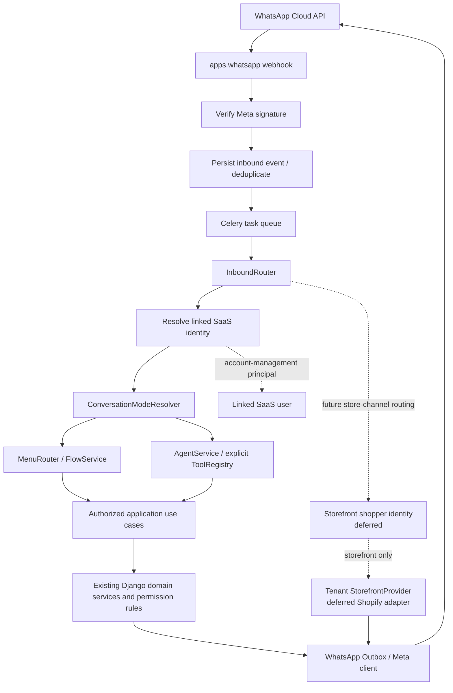
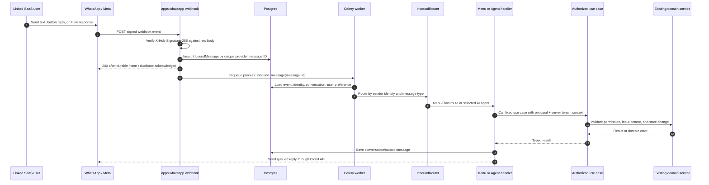
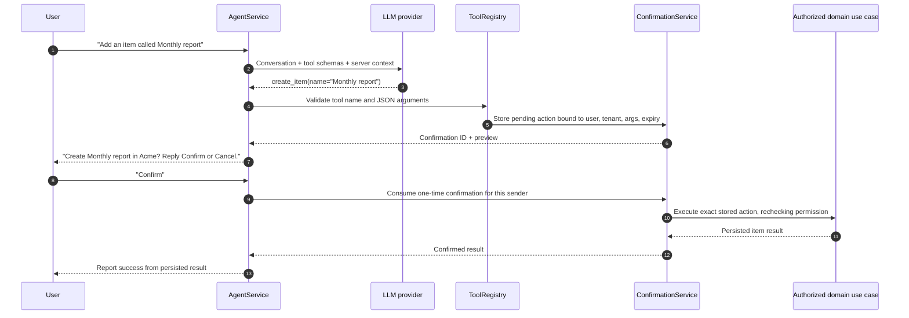
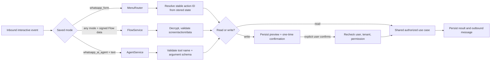

# WhatsApp-First Channel — Implementation Plan

**Date:** 2026-10-06  
**Status:** Draft for maintainer review  
**Goal:** Shape this codebase into a WhatsApp-first SaaS application. WhatsApp is the primary client for supported account, organization, generic CRUD demo item, subscription, and payment use cases after the user links an account. The existing website remains a second client with the same underlying capabilities and data, and keeps the current account sign-up flow. Both clients call channel-neutral application use cases. Native WhatsApp-only account creation is deferred so this first slice can focus on linking existing accounts and day-to-day use. Shopify storefront commerce is a separate, later secondary goal after the current Shopify feature is stable. For payment steps PayFast must host, WhatsApp hands off to a secure checkout link.

## 0. Approach and boundaries

Build one self-contained backend capability, `packages/backend/apps/whatsapp`, and make application use cases available to two clients: WhatsApp first and the React website second. Once linked, WhatsApp is a complete client for the supported SaaS actions, not a thin proxy to website screens. The React client continues to use GraphQL, keeps the current sign-up flow, and can perform the same supported actions. Both adapters call the same channel-neutral use cases and preserve the same persistence, validation, tenant isolation, permissions, and audit events.

For WhatsApp-first SaaS use, a signed inbound Meta message plus an active `WhatsAppIdentity` resolves the sender to a SaaS user. The user first creates an account through the existing website sign-up flow, then links WhatsApp from the profile page or starts linking in WhatsApp and verifies an email challenge. After linking, the user can perform supported day-to-day actions in WhatsApp without returning to the website; the website remains a full second client. Native WhatsApp-only sign-up is deferred. A shopper interacting with a tenant's Shopify store is a separate, deferred principal and does not need a SaaS account or tenant membership. Shopify product/order work and per-tenant shopper routing are not part of this plan's initial delivery.

The Flask reference is [`python-flask-whatsapp-store`](../../../../python-flask-whatsapp-store) in the maintainer's sibling workspace (its files are outside this repository). The patterns worth carrying over are:

- `app/api/chatbot.py`: separate webhook verification, inbound webhook processing, and encrypted Flow data exchange; acknowledge statuses without treating them as user messages.
- `app/services/whatsapp.py`: normalize inbound messages, select a per-user conversation mode, dispatch interactive menu replies separately from text, queue outbound messages, and support explicit handoff.
- `app/services/agent.py`: expose named tools with JSON schemas, map only known tool names to Python functions, cap tool-call turns, preserve multi-turn tool-call history, and tell the agent to confirm consequential actions.
- `app/services/llm_provider.py`: keep provider selection and tool-call response formatting behind an interface.
- `app/services/conversation_state.py`: keep recent conversation context and pending multi-step data with expiry. Its local `shelve` store is not suitable here; use shared persistent state so multiple Django/Celery processes see the same conversation.
- `config.py` and the reference `User.conversation_mode`: a deployment default may exist, but the user's saved profile preference decides the actual mode unless a deliberate administrator override is configured.

The reference application's reservation tools, listing models, FAQ content, and invoice workflows are specific to its accommodation product and do not belong in this generic template. This plan instead exposes the template's generic SaaS use cases in WhatsApp and keeps the website as a second client to those same use cases. “All actions” in the first release means the supported use cases enumerated in section 6; a website screen is not automatically an action unless the corresponding use case is shared and available in WhatsApp. Shopify commerce is explicitly secondary and deferred to step 8 in section 7, gated on the current Shopify installation/linking feature being completed and reviewed.

### 0.1 Payment handoff

PayFast's current flow creates an HTML form with signed fields and redirects the buyer to PayFast when that form is submitted. The existing backend exposes checkout action URL and fields through `PayFastCreateCheckoutMutation`; it does not return a reusable hosted payment URL. Therefore WhatsApp should send a short-lived, single-use URL on this app's web origin. The user opens it, authenticates if necessary, reviews the amount and organization, and the page submits the existing PayFast form. The PayFast ITN remains authoritative for payment completion. Do not put merchant secrets or unsigned payment amounts in WhatsApp URLs. Source: [PayFast custom payment integration](https://developers.payfast.co.za/docs#custom-payment-integration).

### 0.2 WhatsApp platform facts

Use the Cloud API and current supported Graph API version from configuration. Verify GET webhook setup with the configured verification token and return the challenge. Verify POST webhook bodies using `X-Hub-Signature-256` over the raw body and Meta App Secret, with constant-time comparison. Meta's webhook setup and signature guidance: https://developers.facebook.com/docs/graph-api/webhooks/getting-started/.

Use approved message templates where Meta requires them outside an active customer-service window; verify the current messaging rules and pricing as part of implementation rather than hardcoding assumptions in business logic. Cloud API message and template docs: https://developers.facebook.com/docs/whatsapp/cloud-api/guides/send-messages and https://developers.facebook.com/docs/whatsapp/business-management-api/message-templates.

WhatsApp Flows use encrypted request/response data exchange when configured with an endpoint. The reference code's RSA/AES encryption and signature checks are a useful implementation lead, but the port must be validated against Meta's current Flow security and endpoint docs: https://developers.facebook.com/docs/whatsapp/flows/ and https://developers.facebook.com/docs/whatsapp/flows/guides/implementingyourflowendpoint.

## 1. Existing capabilities and reuse

- **Identity and organization:** `apps.users` supplies user authentication and `apps.multitenancy` supplies tenants, memberships, role assignments, invitations, and GraphQL mutations. Creating an organization is a protected user use case; tenant context must be chosen from the sender's actual memberships.
- **Generic CRUD:** `apps.demo` provides tenant-scoped `CrudDemoItem` GraphQL create, read, update, and delete operations with `features.crud.manage` permission checks. Its mutations use tenant-dependent mutation base classes.
- **Billing:** `apps.finances` and `apps.payfast` expose backend-neutral billing dispatch and PayFast subscription/checkout operations. PayFast resolvers use `billing.view` or `billing.manage`; one-off donation checkout is also an existing example of payment handoff.
- **API composition:** `config/schema.py`, `config/urls_api.py`, and `config/settings.py` are composition points. GraphQL is authenticated through `DRFAuthenticatedGraphQLView`; the public PayFast ITN is a narrowly scoped webhook.
- **MCP precedent:** `packages/mcp-server/operations/` declares named, explicit query and mutation tools. `config.yaml` forwards authentication and tenant headers. This shows the desired allowlist shape, but the WhatsApp webhook must authenticate the actual sender and inject server-resolved identity/tenant context itself; it must not trust caller-supplied tenant IDs.
- **Shopify connection:** the current, in-progress `apps.shopify` slice associates `ShopifyShop` with a tenant and has a `read_products` scope in `shopify.app.toml.example`. Its installation plan says product/order reading and messaging are later work. WhatsApp should depend on a narrow tenant-storefront port; the later commerce plan owns Shopify catalog/inventory/checkout implementation and any scope, API, and privacy changes.

## 2. How it works (diagrams)

The first release has two principal types. `SaaSUserPrincipal` represents a linked account holder using WhatsApp to manage their own account, tenant, CRUD demo items, or billing. `StorefrontCustomerPrincipal` represents a shopper talking to a tenant's store; this principal is deferred and must not receive tenant membership or SaaS permissions. Keep that distinction in types and services so a linked merchant identity can never be mistaken for a shopper identity.

### 2.1 System components



### 2.2 SaaS administration request path



### 2.3 AI confirmation path

The model proposes an allowlisted action; server code validates it, creates a pending confirmation, and returns a preview. The model does not get to treat its own response as confirmation or success.



### 2.4 Provider checkout handoff

A WhatsApp message contains only an opaque handoff URL. The checkout record keeps the provider payload server-side and is consumed once by the web route.

```mermaid
sequenceDiagram
    autonumber
    participant U as WhatsApp user
    participant W as WhatsApp channel
    participant B as Django backend
    participant DB as PayFastCheckout + WhatsApp handoff
    participant Web as Webapp handoff route
    participant P as PayFast
    participant ITN as Existing PayFast ITN

    U->>W: Request a plan or payment
    W->>B: Authorized use case creates provider checkout
    B->>DB: Store checkout + opaque expiring handoff token
    B-->>W: Return app-origin handoff URL
    W-->>U: Send link with amount/purpose summary
    U->>Web: Open URL, sign in if needed
    Web->>B: Redeem token; recheck user, tenant, permission, expiry
    B-->>Web: Single-use provider checkout fields
    Web->>P: Submit existing PayFast form
    P-->>U: Hosted checkout experience
    P->>ITN: Notify existing backend endpoint
    ITN->>DB: Verify and persist provider outcome
    DB-->>B: Checkout status becomes complete/failed/cancelled
    B-->>W: Subsequent status query uses persisted provider state
```

### 2.5 Deferred Shopify shopper path

Routing must happen before product tools are available. A chat number or validated entry context identifies exactly one tenant; the shopper principal then remains scoped to that store and does not pass through SaaS membership authorization.

```mermaid
sequenceDiagram
    autonumber
    participant Buyer as Store shopper
    participant Meta as WhatsApp / Meta
    participant WA as WhatsApp webhook
    participant Channel as Tenant WhatsApp channel registry
    participant Store as Tenant StorefrontProvider
    participant Shopify as Shopify Storefront API

    Buyer->>Meta: Open tenant's WhatsApp channel and ask for a product
    Meta->>WA: Signed inbound event with receiving phone number ID
    WA->>Channel: Resolve receiving channel to one tenant + active shop
    Channel-->>WA: Tenant context and storefront config
    WA->>Store: Search products as StorefrontCustomerPrincipal
    Store->>Shopify: Storefront API product query
    Shopify-->>Store: Products / availableForSale / cursor
    Store-->>WA: Tenant-scoped result
    WA-->>Buyer: Product choices and current availability wording
    Buyer->>WA: Select variant and request checkout
    WA->>Store: Create/update cart; retrieve checkoutUrl
    Store-->>WA: Validated Shopify-hosted checkout URL
    WA-->>Buyer: Send checkout link
```

The future shopper diagram requires tenant WhatsApp channel onboarding or an equally strong routing mechanism. A single shared SaaS support number does not imply which tenant's store the shopper intends to use.

### 2.6 Link a WhatsApp identity to a SaaS user

The user can start linking from the website profile or by sending `LINK` to the configured WhatsApp number. Linking verifies both control of the WhatsApp sender through Meta's signed event and access to the existing SaaS account through a one-time email challenge. It does not change website sign-up or authenticate future website sessions.

```mermaid
sequenceDiagram
    autonumber
    participant User as Existing SaaS user
    participant Web as Optional profile page
    participant API as Link API
    participant DB as WhatsAppLinkChallenge
    participant Mail as Account email
    participant Meta as WhatsApp / Meta
    participant Hook as Signed webhook

    alt Start from website
        User->>Web: Choose Link WhatsApp
        Web->>API: startWhatsAppLink()
        API->>DB: Store random nonce + short expiry
        API-->>Web: Return wa.me URL with LINK nonce
        Web-->>User: Open WhatsApp and send prefilled message
    else Start in WhatsApp
        User->>Meta: Send LINK
    end
    Meta->>Hook: Signed inbound event with wa_id + message ID
    Hook-->>User: Ask for existing account email
    User->>Meta: Reply with account email
    Hook->>DB: Create rate-limited email challenge; do not reveal account existence
    DB->>Mail: Send one-time code to matching account email
    Mail-->>User: One-time verification code
    User->>Meta: Reply with code
    Meta->>Hook: Signed inbound event with wa_id + code
    Hook->>DB: Validate and consume email challenge once
    DB-->>Hook: Existing SaaS user + verified wa_id
    Hook->>DB: Create active WhatsAppIdentity
    Hook-->>Meta: Acknowledge delivery
    Web->>API: Refresh WhatsApp settings
    API-->>Web: Linked status (masked number)
```

### 2.7 Menu and Flow dispatch

Menu and AI modes share use cases; the route differs only in how the user's intent is gathered. A Flow endpoint responds synchronously to the encrypted exchange, while longer-running use cases return a short acknowledgement and continue via a WhatsApp message.



## 3. Backend design

### 3.1 Proposed backend package layout

The tree below is the target shape, not a claim that these files already exist. Keep modules narrow and follow the repository's current Django app/test conventions. `storefront/` is only an interface in this plan; the Shopify adapter is deliberately deferred.

```text
packages/backend/apps/whatsapp/
├── __init__.py
├── apps.py
├── admin.py
├── checks.py
├── constants.py                 # modes, message states, tool/action names
├── models.py                    # WhatsAppIdentity, Conversation, Message, PendingAction, CheckoutHandoff
├── serializers.py               # validate link requests and user preference inputs
├── schema.py                    # authenticated preference/link status GraphQL fields and mutations
├── urls.py                      # webhook, flow endpoint, handoff endpoints
├── views.py                     # thin HTTP adapters only
├── verification.py              # Meta signature and Flow request validation
├── client.py                    # Meta Cloud API HTTP client
├── tasks.py                     # process webhook event and send outbox messages
├── services/
│   ├── __init__.py
│   ├── identity.py              # SaaS account linking and identity resolution
│   ├── conversations.py         # state, expiry, mode selection, message history
│   ├── inbound.py               # normalize/deduplicate/dispatch incoming events
│   ├── outbound.py              # outbox, retries, status correlation
│   ├── menus.py                 # stable menu action IDs and deterministic routes
│   ├── flows.py                 # encrypted Flow exchange and input validation
│   ├── confirmations.py         # preview, bind, expire, consume one-time actions
│   ├── checkout_handoff.py      # create/redeem expiring provider handoff
│   ├── use_cases.py             # WhatsApp principal/context and channel facade
│   └── storefront.py            # StorefrontProvider protocol only; no Shopify code here
├── agent/
│   ├── __init__.py
│   ├── provider.py              # LLMProvider protocol + concrete provider adapter
│   ├── service.py               # bounded tool loop and WhatsApp-safe answer formatting
│   ├── tools.py                 # explicit names/schemas to use-case mapping
│   └── prompts.py               # concise prompts; no authorization rules live only here
├── migrations/
└── tests/
    ├── test_settings.py
    ├── test_models.py
    ├── test_identity.py
    ├── test_verification.py
    ├── test_views.py
    ├── test_inbound.py
    ├── test_outbound.py
    ├── test_menu_router.py
    ├── test_flows.py
    ├── test_use_cases.py
    ├── test_confirmations.py
    ├── test_checkout_handoff.py
    ├── test_agent.py
    └── test_smoke.py
```

Composition changes stay in existing roots: add app/settings to `packages/backend/config/settings.py`, URLs to `config/urls_api.py`, GraphQL fields to `config/schema.py`, and `WhatsAppProcessInboundMessage` to the existing Celery task discovery. No generic business logic belongs in `views.py`, `schema.py`, `client.py`, or `agent/tools.py`; those are adapters to services/use cases.

### 3.2 Settings and startup checks

Use Django settings, not reads from `os.environ` inside app code. Defaults keep the feature disabled for a fresh clone; deployment values are required only when enabled. Keep the Graph API version explicit and upgrade it deliberately after checking Meta's current supported versions.

```python
# config/settings.py — proposed additions; values are placeholders/defaults, not secrets.
WHATSAPP_ENABLED = env.bool("WHATSAPP_ENABLED", default=False)
WHATSAPP_GRAPH_API_VERSION = env("WHATSAPP_GRAPH_API_VERSION", default="")
WHATSAPP_ACCESS_TOKEN = env("WHATSAPP_ACCESS_TOKEN", default="")
WHATSAPP_PHONE_NUMBER_ID = env("WHATSAPP_PHONE_NUMBER_ID", default="")
WHATSAPP_BUSINESS_ACCOUNT_ID = env("WHATSAPP_BUSINESS_ACCOUNT_ID", default="")
WHATSAPP_APP_SECRET = env("WHATSAPP_APP_SECRET", default="")
WHATSAPP_VERIFY_TOKEN = env("WHATSAPP_VERIFY_TOKEN", default="")
WHATSAPP_PUBLIC_BASE_URL = env("WHATSAPP_PUBLIC_BASE_URL", default="")
WHATSAPP_DEFAULT_CONVERSATION_MODE = env(
    "WHATSAPP_DEFAULT_CONVERSATION_MODE", default="whatsapp_form"
)
WHATSAPP_FLOW_PRIVATE_KEY = env("WHATSAPP_FLOW_PRIVATE_KEY", default="")
WHATSAPP_FLOW_PASSPHRASE = env("WHATSAPP_FLOW_PASSPHRASE", default="")
WHATSAPP_CONVERSATION_TTL_SECONDS = env.int(
    "WHATSAPP_CONVERSATION_TTL_SECONDS", default=1800
)
WHATSAPP_AI_PROVIDER = env("WHATSAPP_AI_PROVIDER", default="openai")
WHATSAPP_AI_MODEL = env("WHATSAPP_AI_MODEL", default="")
WHATSAPP_AI_MAX_TOOL_CALLS = env.int("WHATSAPP_AI_MAX_TOOL_CALLS", default=5)
```

`apps.whatsapp.checks` reports one actionable `whatsapp.E001` per missing required production setting, an unsupported `WHATSAPP_DEFAULT_CONVERSATION_MODE`, an invalid API version shape, and an invalid enabled/provider combination. It must not require Meta/LLM secrets when `WHATSAPP_ENABLED=False` or during the test setting. Add matching safe placeholders/comments in `packages/backend/.env.shared`; never commit real credentials. Use the existing encryption/key management pattern for Flow private keys rather than assuming `.env` is a production secret store.

### 3.3 HTTP and GraphQL contracts

Keep public provider callbacks narrow, and keep account settings behind the existing authenticated GraphQL request context.

| Endpoint/field                   | Method and auth                                                         | Purpose and contract                                                                                                                                                                                                                  |
| -------------------------------- | ----------------------------------------------------------------------- | ------------------------------------------------------------------------------------------------------------------------------------------------------------------------------------------------------------------------------------- |
| `/api/whatsapp/webhook/`         | GET, Meta verify token                                                  | Verify subscription and return exactly the supplied challenge on a match.                                                                                                                                                             |
| `/api/whatsapp/webhook/`         | POST, Meta raw-body HMAC                                                | Accept WhatsApp messages and status events; validate signature, persist/dedupe, enqueue, then acknowledge. Never accept user/tenant identity from the body as authority.                                                              |
| `/api/whatsapp/flows/`           | POST, Meta Flow signature + encrypted body                              | Decrypt one exchange, validate the requested screen/action and data, execute only the corresponding Flow operation, and return the encrypted response within Meta's deadline.                                                         |
| `/api/whatsapp/flows/health/`    | GET                                                                     | Health response for Flow configuration; must not leak keys or settings.                                                                                                                                                               |
| `whatsAppSettings`               | Authenticated GraphQL query                                             | Return current user's saved conversation mode and link status; never return raw `wa_id` unless the UI needs a masked value.                                                                                                           |
| `updateWhatsAppConversationMode` | Authenticated GraphQL mutation                                          | Validate and persist only `whatsapp_form` or `whatsapp_ai_agent` for the current user.                                                                                                                                                |
| `startWhatsAppLink`              | Authenticated GraphQL mutation                                          | Create a short-lived one-time nonce bound to the current user and return a `wa.me` URL with prefilled link command. It does not link an identity until a signed inbound message presents the nonce.                                   |
| `disconnectWhatsApp`             | Authenticated GraphQL mutation                                          | Revoke current user's active WhatsApp identity and invalidate pending link challenges/conversation state.                                                                                                                             |
| `redeemWhatsAppCheckout`         | Authenticated webapp GraphQL mutation or session-authenticated endpoint | Redeem an opaque handoff once, after login, rechecking the bound user, tenant, billing permission, provider, expiry, and current checkout state. Return provider fields only in the authenticated response needed to submit checkout. |

GraphQL names above are proposed API names. Tests must pin behavior, not rely on spelling as a requirement if schema conventions require a different name. Public webhook endpoints are exempt from normal cookie JWT auth only because Meta authenticates their requests with its configured signature; they must not be listed as general anonymous APIs.

### 3.4 Service and class responsibilities

| Class/service                | Owns                                                                                                                                   | Must not own                                                                                |
| ---------------------------- | -------------------------------------------------------------------------------------------------------------------------------------- | ------------------------------------------------------------------------------------------- |
| `WhatsAppWebhookView`        | Parse HTTP method, validate headers/body shape, call verifier and durable ingestion service, return provider-appropriate HTTP response | Business rules, LLM calls, synchronous provider sends, tenant selection from untrusted JSON |
| `MetaWebhookVerifier`        | GET verify-token comparison and POST HMAC-SHA256 raw-body verification                                                                 | JSON parsing or business decisions                                                          |
| `WhatsAppCloudClient`        | Send text/template/interactive/Flow messages; normalize timeout/rate-limit/provider errors                                             | Pick recipient, permission checks, construct arbitrary tool replies                         |
| `InboundEventService`        | Normalize supported Meta payloads, persist unique event, classify status vs user message, enqueue after commit                         | Call domain mutations inline in webhook request                                             |
| `InboundRouter`              | Resolve active linked identity, normalize inbound text/button/list/Flow event, choose the route based on persisted preference          | Assume identity from WhatsApp display name or execute an unknown action ID                  |
| `ConversationModeResolver`   | Return explicit per-user mode or configured default                                                                                    | Model choice, authorization, or global force-overrides that hide user preference            |
| `MenuRouter` / `FlowService` | Translate stable UI action IDs and validated Flow data to use-case calls                                                               | Implement domain validation a second time                                                   |
| `AgentService`               | Build concise context, call provider, execute bounded loop over registered tools, serialize result into answer                         | Direct model-to-database access, arbitrary GraphQL, secrets, unbounded recursion            |
| `ToolRegistry`               | Validate tool name and JSON schema, select confirmation policy, invoke one named use case                                              | Discover functions dynamically or accept tenant/user IDs from model arguments               |
| `WhatsAppUseCases`           | Build `WhatsAppOperationContext`, select existing application service, enforce permission/tenant context, return typed results         | Become a second implementation of billing, tenant, or CRUD rules                            |
| `ConfirmationService`        | Create preview and one-use pending action; bind exact args/principal/tenant/expiry; reauthorize on consume                             | Trust a model-generated “confirmed” flag                                                    |
| `CheckoutHandoffService`     | Bind secure one-time link to an existing checkout and verify at redemption                                                             | Change price, provider, tenant, or return URL from browser data                             |
| `OutboxService`              | Persist messages, retry transient failures, correlate delivery statuses                                                                | Repeat the operation that produced the reply                                                |

Use `transaction.on_commit()` when creating the Celery task after a new inbound event; otherwise the worker can race the database transaction. Keep worker tasks idempotent by event ID and operation idempotency key. For outbound sends, persist intent before the external API request, then record provider message ID/status. Exactly-once delivery is not promised by Meta; the goal is at-most-once domain mutation plus retryable message delivery.

Normalize the provider payload before dispatch. One webhook body can contain multiple entries, changes, messages, or statuses; process each supported event in the batch instead of assuming `entry[0].changes[0].value.messages[0]` is the only event.

```python
@dataclass(frozen=True)
class NormalizedInboundMessage:
    provider_message_id: str
    sender_wa_id: str
    receiving_phone_number_id: str
    sender_display_name: str | None
    message_type: Literal["text", "button_reply", "list_reply", "flow_reply", "unsupported"]
    text: str | None
    action_id: str | None
    flow_response: dict[str, object] | None
    received_at: datetime


@dataclass(frozen=True)
class NormalizedDeliveryStatus:
    provider_message_id: str
    status: Literal["sent", "delivered", "read", "failed"]
    provider_error_code: str | None
    occurred_at: datetime
```

`sender_display_name` is presentation-only. A `flow_response` arriving as a normal webhook message is distinct from the synchronous encrypted Flow endpoint exchange; normalize each according to its documented provider event shape. Unknown event kinds are recorded as unsupported metadata and acknowledged after durable receipt so they do not create retry storms.

## 4. Frontend design

### 4.1 Proposed webapp layout

The profile page is currently composed in `packages/webapp/src/routes/profile/profile.component.tsx`; keep the new account preference/link controls there or in a small colocated component. PayFast's form submission helper is `packages/webapp-libs/webapp-finances/src/payfast/submitPayfastCheckout.ts` (confirm exact export during implementation); the provider handoff route belongs with the finance routes so both PayFast and Stripe selection stays centralized.

```text
packages/webapp/src/routes/profile/
├── profile.component.tsx                 # add WhatsApp settings section
└── whatsappSettings/
    ├── whatsappSettings.component.tsx    # mode preference + link status/actions
    ├── whatsappSettings.graphql.ts       # query/mutation documents
    ├── index.ts
    └── __tests__/

packages/webapp-libs/webapp-finances/src/
├── payfast/                              # existing provider-specific checkout helper
│   └── submitPayfastCheckout.ts
└── whatsappCheckout/
    ├── whatsappCheckout.component.tsx    # login/resume and provider handoff page
    ├── whatsappCheckout.graphql.ts       # redeem opaque token after login
    ├── index.ts
    └── __tests__/
```

Register the checkout route in the finance library and root route composition. Profile preference changes use existing authenticated GraphQL patterns and generated client types. The checkout route must never put `fields`, PayFast signatures, customer email/phone, or raw provider tokens in the URL. If the existing finance library has a route ownership constraint, implementation must follow its public export and Nx boundary rather than importing private internals.

## 5. Data model, service contracts, and tool API

### 5.1 Core data model and class responsibilities

These are the intended concepts and invariants. Final Django field types and relation names follow local conventions during implementation.

| Model                                            | Important fields                                                                                                      | Invariants                                                                                                                                                                                                    |
| ------------------------------------------------ | --------------------------------------------------------------------------------------------------------------------- | ------------------------------------------------------------------------------------------------------------------------------------------------------------------------------------------------------------- |
| Existing `User` profile (add one nullable field) | `whatsapp_conversation_mode` (`whatsapp_form`, `whatsapp_ai_agent`, or null)                                          | Null means use the configured default; non-null is the user's explicit choice and always wins over the ordinary deployment default. The profile mutation edits only the current authenticated user.           |
| `WhatsAppIdentity`                               | `user` FK, `wa_id`, `verified_at`, `linked_at`, `revoked_at`                                                          | Unique active `wa_id` and one active identity per SaaS user in v1; linking is proven by a one-time challenge; number changes do not rewrite the user's login phone; no implicit account lookup grants access. |
| `WhatsAppConversation`                           | `identity` FK, nullable `tenant` FK, `mode`, `state`, `last_message_at`, `expires_at`                                 | SaaS conversations belong to one linked user; tenant is selected from that user's memberships and revalidated on every action; expired state is not actionable.                                               |
| `WhatsAppMessage`                                | conversation, provider message ID, direction, message type, status, payload metadata, timestamps                      | Unique provider message ID for inbound dedupe; store only minimum payload needed; sensitive bodies excluded from routine logs; statuses can be updated idempotently.                                          |
| `WhatsAppOutboxMessage`                          | recipient identity/channel, payload, status, attempt count, next retry, provider message ID                           | Persist before sending; retries do not repeat the business mutation; provider errors and final state are observable without logging secrets.                                                                  |
| `WhatsAppPendingAction`                          | conversation, action name, validated arguments JSON, summary, random confirmation token hash, expires at, consumed at | Binds exact arguments to sender and tenant; one-time consume; confirmation causes fresh authorization and validation; stale or changed context is rejected.                                                   |
| `WhatsAppCheckoutHandoff`                        | user, tenant, provider, checkout reference, opaque token hash, created/expiry/consumed timestamps                     | Token is high entropy and single use; amount/provider fields are server-owned; tenant membership and billing permission are checked at creation and redemption.                                               |
| `WhatsAppStorefrontChannel` (deferred)           | tenant, Meta phone-number ID/WABA reference, enabled state, credential reference, linked shop                         | Exactly one tenant/store per receiving phone number; credentials are isolated; no SaaS account identity is inferred from shopper number. This model is out of steps 1–7.                                      |
| `StorefrontCustomer` (deferred)                  | tenant/shop, WhatsApp ID, optional Shopify customer reference, consent/retention timestamps                           | Scoped to one tenant's shop; no tenant membership; customer data follows Shopify and Meta privacy obligations.                                                                                                |

`whatsapp_conversation_mode` belongs on the existing `User` model because this is a profile preference that should survive new conversations and devices. `WhatsAppConversation` may record the mode used for its most recent turn for support/audit, but it must not be the preference source. When a preference changes, discard unsafe pending actions and incomplete form state, keep the durable audit trail, and use the new mode on the next inbound message. For storefront shoppers, a later plan must decide whether mode is a shop default, a shopper preference, or both; do not automatically reuse the merchant's profile mode for shoppers.

Proposed service contracts:

```python
@dataclass(frozen=True)
class SaaSUserPrincipal:
    user_id: int
    wa_id: str


@dataclass(frozen=True)
class StorefrontCustomerPrincipal:
    tenant_id: int
    shop_id: int
    wa_id: str
    customer_id: int | None


@dataclass(frozen=True)
class WhatsAppOperationContext:
    principal: SaaSUserPrincipal | StorefrontCustomerPrincipal
    tenant_id: int | None
    conversation_id: int
    idempotency_key: str


class WhatsAppUseCases(Protocol):
    def list_organizations(self, ctx: WhatsAppOperationContext) -> list[OrganizationSummary]: ...
    def create_organization(self, ctx: WhatsAppOperationContext, name: str) -> OrganizationSummary: ...
    def list_crud_items(self, ctx: WhatsAppOperationContext, cursor: str | None = None) -> ItemPage: ...
    def create_crud_item(self, ctx: WhatsAppOperationContext, name: str) -> ItemSummary: ...
    def update_crud_item(self, ctx: WhatsAppOperationContext, item_id: str, name: str) -> ItemSummary: ...
    def delete_crud_item(self, ctx: WhatsAppOperationContext, item_id: str) -> None: ...


class StorefrontProvider(Protocol):
    def search_products(self, ctx: WhatsAppOperationContext, query: str, cursor: str | None = None) -> ProductPage: ...
    def get_product(self, ctx: WhatsAppOperationContext, product_id: str) -> ProductDetails: ...
    def create_checkout(self, ctx: WhatsAppOperationContext, lines: list[CartLineInput]) -> CheckoutLink: ...
```

The concrete `WhatsAppUseCases` adapter must call existing domain services or carefully extracted shared services, never GraphQL over HTTP with a superuser/service token. `StorefrontProvider` has no concrete implementation until the later Shopify plan. A protocol is useful only if the first feature actually has a second consumer; if the code review finds it speculative overhead, keep the adapter private and defer the abstraction until the Shopify slice is approved.

### 5.2 Explicit tool registry

Tools are a fixed application API, not arbitrary GraphQL and not Python method discovery. Every tool declares its arguments, action class, and confirmation policy in code. Principal and tenant are context, never model arguments.

```python
TOOLS = {
    "list_organizations": ToolSpec(
        args=EmptyArgs,
        permission=None,
        confirmation=ConfirmationPolicy.NEVER,
    ),
    "create_organization": ToolSpec(
        args=CreateOrganizationArgs(name=str),
        permission="organization.create",
        confirmation=ConfirmationPolicy.ALWAYS,
    ),
    "list_crud_items": ToolSpec(
        args=ListItemsArgs(cursor=str | None),
        permission="features.crud.manage",
        confirmation=ConfirmationPolicy.NEVER,
    ),
    "create_crud_item": ToolSpec(
        args=CreateItemArgs(name=str),
        permission="features.crud.manage",
        confirmation=ConfirmationPolicy.ALWAYS,
    ),
    "delete_crud_item": ToolSpec(
        args=ItemIdArgs(item_id=str),
        permission="features.crud.manage",
        confirmation=ConfirmationPolicy.ALWAYS,
    ),
    "create_subscription_checkout": ToolSpec(
        args=PlanSelectionArgs(plan=str),
        permission="billing.manage",
        confirmation=ConfirmationPolicy.ALWAYS,
    ),
}
```

The initial allowlist should be concrete and intentionally short. This table describes product behavior; the exact GraphQL resolver/service names and permission codes must be copied from the current implementation only after the section 7 step 4 audit.

| Tool name                                     | Required arguments from user/model     | Server context                                     | Read/write                      | Confirmation                                                                   |
| --------------------------------------------- | -------------------------------------- | -------------------------------------------------- | ------------------------------- | ------------------------------------------------------------------------------ |
| `list_organizations`                          | none                                   | linked SaaS user                                   | Read                            | None; return only that user's memberships.                                     |
| `select_organization`                         | opaque choice ID from a prior list     | linked SaaS user + membership recheck              | Write conversation context only | Confirm selection in reply; never accepts an arbitrary tenant ID as authority. |
| `create_organization`                         | name                                   | linked SaaS user                                   | Write                           | Show exact name and ask the user to confirm.                                   |
| `list_crud_items`                             | optional cursor                        | selected tenant + linked user                      | Read                            | None.                                                                          |
| `get_crud_item`                               | opaque item choice from prior list     | selected tenant + linked user                      | Read                            | None.                                                                          |
| `create_crud_item`                            | name                                   | selected tenant + linked user                      | Write                           | Preview exact name and confirm.                                                |
| `update_crud_item`                            | opaque item choice + changed fields    | selected tenant + linked user                      | Write                           | Preview old/new values and confirm.                                            |
| `delete_crud_item`                            | opaque item choice                     | selected tenant + linked user                      | Destructive write               | Separate explicit confirmation.                                                |
| `get_billing_summary`                         | none                                   | selected tenant + linked user                      | Read                            | None; requires current billing read permission.                                |
| `create_subscription_checkout`                | plan choice from server-provided plans | selected tenant + linked user                      | External payment initiation     | Confirm plan/amount/interval, then create one-time checkout handoff.           |
| `cancel_subscription` / `change_subscription` | target operation                       | selected tenant + linked user                      | Billing write                   | Explicit confirmation; only expose if active backend supports it.              |
| `create_donation_checkout`                    | amount from server-provided choices    | selected tenant + linked user                      | External payment initiation     | Confirm exact amount and purpose before creating handoff.                      |
| `search_storefront_products` (deferred)       | query + optional cursor                | `StorefrontCustomerPrincipal` + routed tenant/shop | Read                            | None.                                                                          |
| `create_storefront_checkout` (deferred)       | variant choice + quantity              | `StorefrontCustomerPrincipal` + routed tenant/shop | External purchase flow          | Summarize cart and total, then provide validated Shopify checkout URL.         |

`Opaque choice ID` means a server-issued short-lived reference to a result in the current conversation, not the database primary key copied into a tool call. The tool handler resolves it from stored conversation context and then rechecks ownership/tenant membership before it acts.

This is illustrative; permission identifiers must be checked against the actual multitenancy permission registry before implementation. Read tools can return a result immediately. Every write first produces a confirmation preview and only the confirmation endpoint executes it. Add organization membership, invitation, subscription cancel/change, and donation tools only after their exact existing permission and service behavior has been audited. A tool has one operation; avoid broad names such as `execute_graphql`, `update_any_model`, or `run_admin_query`.

## 6. User stories and acceptance criteria

| Story                                | As a                                 | I want                                                                                              | So that                                                 | Acceptance criteria                                                                                                                                                                                                                                                                                                                                                                                                                                                    |
| ------------------------------------ | ------------------------------------ | --------------------------------------------------------------------------------------------------- | ------------------------------------------------------- | ---------------------------------------------------------------------------------------------------------------------------------------------------------------------------------------------------------------------------------------------------------------------------------------------------------------------------------------------------------------------------------------------------------------------------------------------------------------------- |
| 1. Sign up and link WhatsApp         | new or existing SaaS user            | use the current website sign-up, then link WhatsApp from my profile or chat                         | I can use WhatsApp as my primary client after setup     | Existing website sign-up remains unchanged; linking proves control of the WhatsApp sender and the account email with a one-time challenge; responses avoid account enumeration and are rate-limited; one number cannot silently take over another account; disconnect/relink is supported; native WhatsApp-only sign-up is deferred.                                                                                                                                   |
| 2. Pick an interaction mode          | user                                 | choose WhatsApp menus/Flows or conversational AI in my profile                                      | the experience fits my preference                       | Persist enum-like `whatsapp_form` / `whatsapp_ai_agent` preference; show it in profile settings; new inbound messages use the saved choice; a deployment default applies only when the user has no explicit choice; no global env setting silently overrides an explicit user choice.                                                                                                                                                                                  |
| 3. Use menus and Flows               | user                                 | browse supported actions and complete structured forms                                              | I can use WhatsApp without composing prompts            | Menu/list/button replies route by stable action IDs; Flows collect structured values; each Flow result is validated server-side; menus and AI share the same authorized application use cases.                                                                                                                                                                                                                                                                         |
| 4. Create and manage an organization | authenticated user                   | create an organization, list/select organizations, and manage supported membership actions          | I can administer my workspace in chat                   | Create requires an explicit organization name and confirmation; list/select only returns memberships the sender owns; invitations and membership/role changes require their matching permissions and confirmation; ambiguous organization selection asks instead of guessing.                                                                                                                                                                                          |
| 5. Manage CRUD demo items            | organization member                  | list, create, view, update, and delete generic CRUD demo items                                      | I can maintain tenant data in chat                      | Tools map to existing operations and `features.crud.manage`; all reads/writes are tenant-scoped; create/update confirm the intended values and delete has a clear confirmation; unknown item identifiers fail closed.                                                                                                                                                                                                                                                  |
| 6. Manage subscription and payment   | billing-authorized organization user | see plan/status, start or change a subscription, cancel where supported, and make a one-off payment | I can handle billing without navigating the whole site  | `billing.view` protects billing reads and `billing.manage` protects changes; active `PAYMENT_BACKEND` determines available options; payment/plan checkout returns a short-lived web URL; payment success is reported only after the existing provider confirmation updates backend state.                                                                                                                                                                              |
| 7. Use the AI agent safely           | user                                 | ask naturally for supported tasks                                                                   | I can describe what I need conversationally             | Agent tools are explicit and schema-validated; authenticated user and selected tenant are injected by the server; permissions are checked for every action; consequential writes are previewed and confirmed; tool execution has a turn limit and idempotency protection; the agent cannot invent arbitrary GraphQL or Django access.                                                                                                                                  |
| 8. Recover or get help               | user                                 | return to menu, restart an expired flow, or reach a human/support path                              | mistakes and uncertainty do not strand me               | `menu`/`help` escape works in either mode; stale state is expired safely; failures return a concise retry/support response; unsupported actions are named clearly.                                                                                                                                                                                                                                                                                                     |
| 9. Shop through WhatsApp (follow-on) | customer of a tenant                 | browse that tenant's Shopify products and inventory and complete supported storefront actions       | I can shop through the business's WhatsApp conversation | Shopper does not need a SaaS account or tenant membership; incoming chat is routed to exactly one tenant/store by an explicitly configured business channel or signed storefront entry context; customer data is scoped to that tenant's shop; product/availability data comes from its connected Shopify store; checkout uses Shopify's supported checkout; menus and AI share the same allowlisted operations; no Shopify files change in this WhatsApp-first slice. |

## 7. Proposed Changes

Each step stays additive. Write the listed tests first, observe RED, then add production code and observe GREEN. No production code is written before its test.

### Step 1 — Identity linking, profile preference, and conversation records

Create durable identity and conversation primitives before exposing business actions. Preserve the existing website sign-up flow. Let a user start linking from the authenticated profile page or by messaging `LINK`; in either case, require a one-time challenge delivered to the existing account email and a signed inbound WhatsApp message before binding identities. The inbound sender ID alone is not proof that the sender owns an existing user account. Rate-limit challenges and avoid revealing whether an email is registered. Keep one active WhatsApp identity per user unless product review chooses otherwise. Store provider identity separately from user email/phone fields so existing login and phone verification behavior is not changed. Do not add native WhatsApp account creation in this slice.

Add a per-user conversation preference with `whatsapp_form` and `whatsapp_ai_agent` values. The application default is `WHATSAPP_DEFAULT_CONVERSATION_MODE=whatsapp_form`. An explicit profile selection always wins; an administrator override, if retained at all, must be separate, clearly named, and never be the ordinary deployment default. Persist conversation state and inbound/outbound message IDs in the database; use expiry and deduplication constraints so multiple web processes/workers behave consistently. Keep message bodies/history retention minimal and document deletion/retention behavior.

**Tests first:**

- `packages/backend/apps/whatsapp/tests/test_identity.py`: linking proof, already-linked number, number reassignment denied, unlink, unlinked inbound sender.
- `packages/backend/apps/whatsapp/tests/test_conversation_mode.py`: preference validation, saved preference versus deployment default, default on unset preference, invalid setting rejected by system check.
- `packages/backend/apps/users/tests/` profile mutation tests: only the authenticated user can read/update their saved WhatsApp mode; null preference uses configured default.
- `packages/backend/apps/whatsapp/tests/test_models.py`: message dedupe uniqueness, status updates, conversation expiry, tenant/user association.
- `packages/backend/apps/whatsapp/tests/test_settings.py`: setting defaults and allowed modes.
- Webapp profile preference specs in the new `webapp-whatsapp` Nx project (or the existing profile library, after locating its established ownership): display, save, reload, and server validation errors.

**Then add:** `apps/whatsapp/{apps.py,models.py,admin.py,checks.py,services/identity.py,services/conversations.py,migrations/}`; additive settings and `INSTALLED_APPS` composition in `config/settings.py`; nullable `User.whatsapp_conversation_mode` migration plus authenticated GraphQL preference/link fields in `apps/users` or the WhatsApp schema (choose the existing API ownership convention after tracing it); a small preference control under `packages/webapp/src/routes/profile/`. Preserve existing sign-in and phone verification contracts.

### Step 2 — Meta webhook, message client, deduplication, and outbound delivery

Add a public GET/POST webhook route under `/api/whatsapp/`. GET verifies subscription challenge. POST verifies the raw-body signature before parsing, accepts message/status/Flow updates, records provider message IDs idempotently, and acknowledges only after durable acceptance. Dispatch business processing asynchronously through the existing Celery task backend; acknowledge duplicate retries without repeating side effects. Do not log access tokens, message content, Flow secrets, or full phone numbers. Put Meta network calls behind a small client and queue outbound messages so one provider failure does not block webhook acknowledgement.

Keep status updates separate from inbound customer messages. Support text and interactive replies needed by the feature; reject or provide a safe fallback for unsupported message types. Implement delivery status recording for messages the app sends. Configure API version, access token, app secret, verify token, phone number ID, WABA ID, and public app URL through settings, with safe empty defaults plus Django system checks in non-test deployments.

**Tests first:**

- `apps/whatsapp/tests/test_signature.py`: valid/invalid/missing signature, altered raw body, constant-time comparison wrapper behavior.
- `apps/whatsapp/tests/test_views.py`: GET challenge, POST validation, status-only event, supported inbound event, malformed event, and no side effects on invalid signatures.
- `apps/whatsapp/tests/test_webhooks.py`: duplicate delivery, processing task dispatch, status correlation, retry-safe behavior.
- `apps/whatsapp/tests/test_client.py`: text, template, interactive menu, Flow CTA payloads, provider errors and timeouts.
- `apps/whatsapp/tests/test_tasks.py`: task retries and failure recording.
- `apps/whatsapp/tests/test_settings.py` / `test_checks.py`: required production config and optional local setup.

**Then add:** `apps/whatsapp/{views.py,urls.py,webhooks.py,client.py,tasks.py,services/inbound.py}` and tests; include URL and settings at the existing composition points; register task using current Celery conventions. No dependency is needed unless the standard library and existing HTTP stack cannot meet a verified requirement.

### Step 3 — Deterministic menus and WhatsApp Flows

Implement a deterministic interaction router. It handles menu IDs and structured Flow submissions and calls the same application-use-case boundary used by the AI agent. Keep menu labels and actions generic (organization, items, billing, help); never make list content itself an authorization check. Build Flows for organization creation, CRUD item create/update confirmation, subscription choice, and payment handoff only where a Flow materially improves data entry. Validate all Flow input on the server. If encryption/signature requirements apply to a Flow endpoint, implement and test the current Meta protocol rather than copying the reference encryption code without verification.

Use stable opaque action IDs; resolve them against stored user/conversation state instead of encoding trusted object permissions in client-visible IDs. For multi-step tasks, store only pending action parameters and expiry. A user can type `menu`, `help`, or `cancel` to exit a flow. Avoid duplicating business rules in a Flow handler.

**Tests first:**

- `apps/whatsapp/tests/test_menu_router.py`: known actions, unknown action, invalid/stale action, menu escape, deterministic mode routing.
- `apps/whatsapp/tests/test_flows.py`: encrypted request verification/decryption vectors from Meta documentation, valid input, bad signature, invalid fields, expired flow state, and response encryption.
- `apps/whatsapp/tests/test_use_cases.py`: the same operation can be invoked from menu dispatch with user and tenant context.
- Webapp/Nx tests only if a browser link/selection surface is added in this step.

**Then add:** `apps/whatsapp/services/menu.py`, `services/flows.py`, Flow definitions under `apps/whatsapp/flows/`, and any minimal webapp route for secure handoff. Document Flow publishing and endpoint health checks. Do not add accommodation-specific listings, bookings, FAQ data, or invoice models from the reference store.

### Step 4 — Shared application-use-case boundary and permission audit

Before exposing write tools, define the narrow use cases available to both menu and agent dispatch. Where current behavior exists only inside a GraphQL resolver, extract the smallest service that preserves its serializer, validation, audit logging, tenant scoping, and transaction semantics; let the existing resolver and WhatsApp adapter call that same service. Do not call GraphQL over localhost with a privileged service account as a shortcut.

Create explicit use cases for:

- Organization: list memberships, select current tenant, create organization; invitation and membership actions only after each matching GraphQL mutation's access rules have been audited and wrapped.
- CRUD demo item: list, create, view, update, delete using `apps.demo` serializers/tenant-dependent mutation rules and `features.crud.manage`.
- Billing: read current plan/subscription and transaction status with `billing.view`; create/choose subscription checkout, cancel/change subscription, and create one-off donation checkout only with `billing.manage` and any stricter existing action-level permission. Expose only operations supported by the active backend.

For each use case, audit the WhatsApp entrypoint separately under [`agents.md` section 3.5](../agents.md): identify the authenticated principal, tenant source, role/permission needed, data boundaries, and audit event. Treat unlinked users as unauthenticated. Never infer authority from a WhatsApp profile name, phone number alone, LLM response, or tenant ID in a message.

**Tests first:**

- `apps/whatsapp/tests/test_use_cases_organization.py`: org creation, memberships, cross-tenant denial, role/permission denial.
- `apps/whatsapp/tests/test_use_cases_crud.py`: complete CRUD happy paths, cross-tenant item ID, missing permission, validation errors, action log.
- `apps/whatsapp/tests/test_use_cases_billing.py`: view/manage permission split, backend selection, checkout status, disallowed operation, no client-controlled tenant/amount.
- Regression tests in `apps/multitenancy/tests/`, `apps/demo/tests/`, and `apps/payfast/tests/` only when extracting behavior from their existing resolvers.

**Then add:** `apps/whatsapp/services/use_cases.py` or focused service modules, plus the smallest additive changes to `apps/multitenancy`, `apps/demo`, `apps/finances`, and `apps/payfast` needed to share their established service logic. Keep GraphQL schemas as public web contracts and update them only if the preference or handoff needs a new authenticated field.

### Step 5 — Secure PayFast and Stripe checkout handoff

Add an expiring, single-use checkout handoff record bound to the requesting user, tenant, intended checkout, and payment purpose. Creating the record requires the existing billing permission and uses the current backend checkout service. The URL contains only a high-entropy opaque token; store a hash, enforce expiry and one-time consumption, prevent open redirects, and do not allow the browser to change the amount, plan, tenant, or return path. Require login when the chat user is not already authenticated in the browser, then confirm the user still has the required tenant permission before submitting the checkout.

For PayFast, the web route renders/submits the server-created `action_url` and signed `fields` already used by `PayFastCreateCheckoutMutation`; payment state remains pending until a verified ITN changes it. For Stripe, use the existing Stripe checkout flow and never construct a second payment path. The WhatsApp reply states that payment is pending until the provider confirms it. Return and cancel routes offer a safe way back to WhatsApp/web app without exposing payment data.

**Tests first:**

- `apps/whatsapp/tests/test_checkout_handoff.py`: opaque token, hash-at-rest, expiry, replay, user/tenant mismatch, changed permissions, open redirect, amount/plan tampering.
- `apps/payfast/tests/` and `apps/finances/tests/`: existing checkout service integration remains correct and ITN-only confirmation is preserved.
- New webapp checkout route specs in the Nx project that owns billing/PayFast form submission: valid link, expired link, login required, duplicate submit, provider return/cancel.

**Then add:** `apps/whatsapp` handoff model/service/view and URL; narrowly scoped webapp handoff route reusing the PayFast form submission helper and Stripe checkout page; safe copy/return links. Do not expose raw signed checkout fields in logs or persistent WhatsApp conversation history.

### Step 6 — AI mode, provider boundary, explicit tools, and confirmations

Build agent mode using a provider interface similar to the reference `llm_provider.py`, with configuration for a supported provider/model and bounded request timeout. Use durable conversation turns that preserve assistant tool-call and tool-result messages; cap history and tool calls per message; handle malformed model output, provider outages, duplicate webhook delivery, and expired context. A new setting such as `WHATSAPP_AI_PROVIDER`, `WHATSAPP_AI_MODEL`, and `WHATSAPP_AI_MAX_TOOL_CALLS` must have safe defaults and setting/system-check tests. No global setting may erase a saved user mode.

The allowlist is fixed in code and maps names to the shared application-use-case layer. Initial tools: list/select/create organization; list/create/view/update/delete CRUD demo item; read plan/subscription/payment status; create subscription checkout; cancel or change plan only when the existing billing use case supports it; create one-off donation checkout. Tools receive the verified user and server-selected tenant as context, not LLM arguments. Parse/validate arguments with schemas and backend serializers. For create/update, present a concise preview and require the user's explicit confirmation in a later inbound message before committing. Delete, cancel subscription, invitations, and role changes always require a separate explicit confirmation. A tool result is data for the model to summarize, never authority to claim success; confirmations derive from persisted backend state.

Conversation mode routing happens before model invocation. In `whatsapp_form`, free text maps to a help/menu response unless it is a direct supported Flow/menu continuation. In `whatsapp_ai_agent`, free text reaches the agent; interactive replies still route through their stable deterministic IDs. A user can switch modes from profile settings and through a small explicit WhatsApp preference action after identity is linked.

**Tests first:**

- `apps/whatsapp/tests/test_agent.py`: tool loop, tool allowlist, turn cap, provider errors, malformed arguments, profile-context isolation, help/menu escape.
- `apps/whatsapp/tests/test_confirmations.py`: preview/confirm/cancel, changed arguments invalidate confirmation, one-time confirmation, stale confirmation, deletion/cancellation explicit confirmation.
- `apps/whatsapp/tests/test_conversations.py`: tool-call history shape, expiry, concurrent messages, no cross-user conversation reuse.
- `apps/whatsapp/tests/test_conversation_mode.py`: saved mode determines dispatch; switching modes does not expose another user's state.
- LLM/provider tests use a fake provider; no live model key or external call is required in automated tests.

**Then add:** `apps/whatsapp/agent/{provider.py,tools.py,service.py,prompts.py}`, narrow provider configuration, confirmation state/service, and deterministic fake-provider tests. Define the tool registry against use-case/provider interfaces, including a storefront port that has no Shopify implementation in this plan. Add no agent framework dependency unless a verified feature cannot be implemented safely with the existing stack.

### Step 7 — Webapp preference, onboarding, operational setup, and seed data

Finish the reachable user journey: profile control for conversation mode; WhatsApp identity linking/disconnecting; clear connection state and test instructions; a secure login-resume page for checkout links; and safe confirmation/status copy. Add an idempotent development seed command for linked and unlinked users, both modes, multiple tenant memberships with different roles, and CRUD items in more than one tenant. Ensure the seeded phone numbers are documentation placeholders and cannot be mistaken for live customer identities.

Add operator documentation for Meta app/webhook setup, production secrets, Graph API version upgrades, approved templates, Flow publishing, public HTTPS callback URLs, webhook replay/debugging without PII, AI provider configuration/cost controls, message retention, consent, and human escalation. Keep all credentials out of tracked files. Mention Meta service/template costs and current message window behavior with a link to the official pricing/policy pages that are verified during implementation.

**Tests first:**

- Webapp specs for preference, linking, disconnect, login-resume, and checkout errors.
- `apps/whatsapp/tests/test_seed.py`: idempotence, expected representative states, safe production refusal.
- `apps/whatsapp/tests/test_smoke.py`: one end-to-end backend path with fake Meta client and fake AI provider, from signed webhook through a permission-checked use case and queued response.
- Nx lint/type-check/test specs for each touched webapp project.

**Then add:** profile UI and public exports, seed command and tests, docs under `packages/internal/docs/docs/working-with-sb/` or a feature-specific docs section following the docs package convention, `.env.shared` placeholders if required, and changelog entry per repository release rules.

### Step 8 — Deferred: tenant Shopify storefront and inventory tools

This step is intentionally not part of the current implementation. It starts only after the maintainer has completed and reviewed the in-progress Shopify feature. The existing Shopify slice installs a shop, links it to a tenant, encrypts/refreshes its Admin API credentials, and currently requests `read_products`; the installation plan explicitly leaves product/order reading and messaging channels for later. WhatsApp work in steps 1–7 must not edit Shopify files or widen Shopify scopes.

Before implementation, write a focused Shopify commerce design/plan that answers which customer actions are in scope (at minimum product discovery and availability; checkout is expected to hand off to Shopify's supported storefront checkout), how inbound WhatsApp traffic selects one tenant/store (tenant-owned WhatsApp Business number versus a signed entry link/context), how a chat-only shopper is represented without a SaaS user account, how the shopper is associated with an order if needed, and which Shopify scopes/actions are needed. Audit current Shopify API support and data/privacy webhook obligations then. Do not collect a customer's Shopify password, expose Admin API tokens, or let an AI agent query arbitrary Admin API GraphQL.

The extension point from this plan should accept a tenant-scoped storefront provider. The later Shopify adapter may use only an installed, active `ShopifyShop` owned by the selected tenant and the existing Shopify Admin API client/token-refresh lifecycle for data that legitimately requires Admin API access. Public product discovery should use Shopify's Storefront API rather than treating merchant Admin API access as a customer-facing storefront API ([products query](https://shopify.dev/docs/api/storefront/latest/queries/products)). Its `availableForSale` signal can support a customer-facing availability answer; exact inventory quantities require a separate scope/API review (Shopify Admin `InventoryLevel` requires `read_inventory`: https://shopify.dev/docs/api/admin-graphql/latest/objects/InventoryLevel). The current `read_products` scope alone must not be assumed to authorize every inventory quantity. Shopify's Storefront API cart exposes `checkoutUrl` for Shopify web checkout ([cart query](https://shopify.dev/docs/api/storefront/latest/queries/cart)); hand off to that URL after validating its shop host. Menus and AI share the same product search/details/cart/checkout use cases; authorization and customer-data boundaries are enforced by those use cases.

The current WhatsApp setup in steps 1–7 assumes one configured platform number for SaaS users. It does not satisfy per-tenant shopper routing. The later commerce design must include the chosen WhatsApp Business Account/number onboarding and secret isolation, or a verifiable entry-context mechanism that cannot be forged to access another shop. This is a separate decision from the SaaS user's profile link and mode preference.

**Tests first (in the later Shopify plan):** provider contract and tenant isolation; shopper with no SaaS account; inbound number/entry-context routing to exactly one tenant; no active shop, uninstalled shop, wrong-tenant shop; product pagination and stale/error responses; inventory display semantics; checkout URL host and tamper checks; tool schema/confirmation; Meta message and Flow rendering. Tests and production changes belong to that later plan and may touch Shopify files only when that separate work is explicitly approved.

## 8. Risks and mitigations

| Risk                                                                            | Mitigation                                                                                                                                                                                               |
| ------------------------------------------------------------------------------- | -------------------------------------------------------------------------------------------------------------------------------------------------------------------------------------------------------- |
| Meta retries the same webhook and a write runs twice                            | Persist unique provider message ID before enqueue; make processing idempotent; bind any domain write to a unique operation key; test duplicate and concurrent delivery.                                  |
| Attacker forges a sender or changes a tenant in payload/action ID               | Verify Meta HMAC over raw body; treat sender as unlinked until one-time account linking succeeds; resolve tenant from saved membership and recheck every operation.                                      |
| Linking challenge is stolen, replayed, or attached to a different SaaS account  | Use random short-lived nonce stored hashed and bound to authenticated user; consume once only after valid webhook; limit attempts; revoke previous challenge on new start.                               |
| AI makes up a successful result or calls a dangerous tool                       | Strict name/schema allowlist; server-side use case validation; explicit write preview; one-time confirmation; success messages come from persisted domain result.                                        |
| LLM or Graph API latency exceeds webhook/Flow deadline                          | Webhook only verifies/persists/enqueues; worker handles normal messages. Keep Flow endpoint synchronous and narrowly scoped; avoid model calls in Flow data exchange; use bounded timeouts.              |
| Outbound message retry duplicates user-visible messages                         | Store outbox intent and provider IDs/status, use idempotency where Meta supports it, and distinguish retryable API failure from accepted send; do not claim exactly-once delivery.                       |
| Payment handoff leaks signed fields, is replayed, or redirects to attacker site | URL carries opaque one-time token only; fields remain server-side; recheck auth/tenant/permission; allowlist provider and return paths; expiry and replay tests; ITN/provider state is authoritative.    |
| Saved user mode is unexpectedly overridden by environment                       | Environment setting supplies only the unset preference default; mode resolver has a dedicated precedence test and no legacy global override.                                                             |
| Shopify shopper is routed to another tenant                                     | Defer commerce until explicit per-tenant channel or signed entry-context design; isolate shopper identity by tenant/shop; reject ambiguous or disabled channel mappings.                                 |
| More personal data is retained than needed                                      | Store minimal message content, set expiry/retention policy, redact logs, implement unlink/deletion behavior, and include the required Meta/Shopify privacy handling in the later customer-commerce plan. |

## 9. File Summary

### New backend capability

- `packages/backend/apps/whatsapp/`: settings, system checks, app config, identity/conversation/message/handoff models, migrations, admin, signature verification, Meta client, webhook views/URLs, asynchronous tasks, inbound routing, menus/Flows, AI provider/tool registry, shared use-case adapters, tests, and an idempotent seed command.
- `packages/backend/config/settings.py`, `config/urls_api.py`, and `config/schema.py`: additive composition only.
- Existing `apps.users`, `apps.multitenancy`, `apps.demo`, `apps.finances`, and `apps.payfast`: small service-boundary or profile-preference changes only when tests prove the existing behavior remains intact.
- Existing user profile surface: nullable conversation-mode field and authenticated preference mutation; profile UI in `packages/webapp/src/routes/profile/`.

### New or extended webapp surface

- Profile preference and WhatsApp identity linking UI in the existing owning profile library or a small `webapp-whatsapp` Nx library after checking current module ownership.
- Secure frontend checkout-handoff route reusing existing PayFast/Stripe payment flows.
- Generated API schema/types if GraphQL changes, using `pnpm nx run webapp-api-client:graphql:download-schema`.

### Documentation and release

- Feature guide in `packages/internal/docs/docs/` following its existing Docusaurus structure.
- `CHANGELOG.md` versioned Documentation/Features entry as selected by the maintainer before implementation is committed.
- Development seed data and human checks described in section 10.

## 10. Verification Plan

### Automated tests

- Every step writes its failing tests first and observes RED before production changes.
- Run focused backend test files inside the backend container for each RED/GREEN micro-step.
- Final backend GREEN: `pnpm nx run backend:test`.
- Final frontend GREEN: for each touched Nx project, `pnpm nx run <project>:lint`, `pnpm nx run <project>:type-check`, and `pnpm nx run <project>:test --watchAll=false`.
- Regenerate and commit GraphQL schema/types when the schema changes.
- Because this touches Postgres, Redis/Celery, and Meta/PayFast integrations: after automated GREEN, run the full local stack via `pnpm saas up`, then perform the checks below. No automated test calls Meta, PayFast, Stripe, or a live LLM.

### Human checks

After the test seed command and local stack are in place:

1. Open the web app as the seeded linked user, change profile mode to **Menus and Flows**, reload, and confirm the choice persists. Repeat with **AI conversation**. An unset preference follows the configured default.
2. Create an account through the existing website sign-up flow. As an unlinked sender, message the configured WhatsApp test number with `LINK`; provide the account email and one-time code. The bot does not reveal tenant, billing, or CRUD data before linking. Retry and confirm supported actions work after linking. Also start linking from the website profile page and confirm it reaches the same verified identity state.
3. Send a duplicate delivery with the same Meta message ID using a signed webhook fixture. The endpoint acknowledges it and the action is not repeated.
4. In menu mode, create an organization and select it. The bot confirms the created organization and subsequent actions use that selected tenant.
5. In menu mode, list, create, update, and delete a seeded CRUD demo item. Confirm delete explicitly; cancel once and verify the row remains.
6. In AI mode, ask to create an item with name and organization. Confirm the preview; then query the list and verify the persisted item. Ask to delete it; decline confirmation and verify it remains.
7. As a user with `billing.view` but without `billing.manage`, ask for the current subscription (allowed) and then ask to change/cancel it (denied with a useful message).
8. As a billing manager with PayFast active, request a subscription checkout. Open the WhatsApp link, confirm amount and organization, complete sandbox checkout, and verify the bot reports success only after the verified ITN updates the backend. Reopen the consumed/expired link; it must not create a second checkout.
9. Request a one-off payment/donation link. The link opens the appropriate provider checkout; cancel it and verify payment is not recorded as complete.
10. Switch `PAYMENT_BACKEND` to Stripe in a local environment and repeat the billing menu. Only Stripe-supported choices are shown, and the PayFast handoff cannot be used.
11. Submit a webhook with a bad `X-Hub-Signature-256` and confirm a client error with no message row, task, outbound message, or business side effect.
12. Allow Flow state to expire, then submit its old response. The bot explains that the flow expired and offers to restart; it does not mutate data.

## 11. Decisions and open questions

1. **Channel is generic; generic CRUD remains the example resource.** This matches `agents.md` sections 4.5 and the maintainer's requested account/organization/billing/CRUD scope. Product-specific tools from the Flask reference stay in that product. Tenant-owned Shopify storefront commerce is a later generic capability, and will get its own plan after the existing Shopify feature is stable.
2. **User profile preference beats deployment default.** The reference currently supports a global `CONVERSATION_MODE` override before the profile setting. The SaaS implementation should not let an ordinary environment value unexpectedly overrule a user's saved preference. If operations require a forced maintenance mode, design it as a separate explicit override and test/document its precedence.
3. **A WhatsApp number must be explicitly linked.** Do not automatically match a sender's number to an account and grant access. Pick the verification method and expiry/rate limits during step 1 based on existing account security conventions; prefer requiring an authenticated web session and proving control of the WhatsApp number.
4. **“All website actions” is scoped to the supported vertical slices.** New website features do not become automatically callable; each gets an audited tool/Flow, permission mapping, tests, and confirmation design.
5. **Checkout remains on the provider's secure hosted flow.** PayFast's existing GraphQL response is form action + signed fields; the proposed short-lived app URL is a handoff to render/submit them. Confirm whether the existing frontend can host this route without exposing the backend-signed form payload in URL or browser storage. If not, add the smallest webapp route that fetches it after login.
6. **Embedded signup and SaaS customer-owned WABAs are not included in the first slice.** Initial rollout configures one platform WhatsApp Business Account/phone number for SaaS users. That does not route tenant shoppers to a tenant's storefront; the deferred commerce plan must add tenant channel onboarding or another verified routing mechanism and credential isolation.
7. **Shopify storefront actions are deferred until the current Shopify feature is complete.** The long-term product goal is customer interaction with each tenant's Shopify products and inventory through WhatsApp. Shoppers are not SaaS users and do not receive tenant-member permissions. No edits to `apps.shopify` or `webapp-shopify` are included here. The later plan must choose tenant WhatsApp routing/channel ownership, shopper identity and order association, product discovery API, inventory freshness semantics, checkout handoff, and required scopes.
8. **Conversation mode switching and message retention need product review.** This draft proposes profile UI plus a chat shortcut and limited expiring history. Confirm whether history should be retained for a specific period and whether an operator-facing human-handoff inbox is in the initial release.

## 12. Sources

- Reference implementation, WhatsApp webhook and menu/Flow service: `/home/kgotso-koete/Documents/Projects/Personal/WhatsApp/python/python-flask-whatsapp-store/app/api/chatbot.py` and `app/services/whatsapp.py`.
- Reference implementation, tool-using agent and provider abstraction: `/home/kgotso-koete/Documents/Projects/Personal/WhatsApp/python/python-flask-whatsapp-store/app/services/agent.py`, `app/services/llm_provider.py`, `app/services/openai.py`.
- Reference implementation, conversation state and profile mode: `/home/kgotso-koete/Documents/Projects/Personal/WhatsApp/python/python-flask-whatsapp-store/app/services/conversation_state.py`, `config.py`, and `app/models.py` (`User.conversation_mode`).
- Meta WhatsApp Cloud API webhook setup and signature verification: https://developers.facebook.com/docs/graph-api/webhooks/getting-started/.
- Meta WhatsApp Cloud API messages and templates: https://developers.facebook.com/docs/whatsapp/cloud-api/guides/send-messages and https://developers.facebook.com/docs/whatsapp/business-management-api/message-templates.
- Meta WhatsApp Flows: https://developers.facebook.com/docs/whatsapp/flows/ and https://developers.facebook.com/docs/whatsapp/flows/guides/implementingyourflowendpoint.
- PayFast custom payment form: https://developers.payfast.co.za/docs#custom-payment-integration.
- Shopify Storefront API product discovery and cart checkout: https://shopify.dev/docs/api/storefront/latest/queries/products and https://shopify.dev/docs/api/storefront/latest/queries/cart.
- Shopify Admin inventory level permission: https://shopify.dev/docs/api/admin-graphql/latest/objects/InventoryLevel.
- Current Shopify installation and tenant-link plan: [`2026-10-03-shopify-app-installation-plan.md`](2026-10-03-shopify-app-installation-plan.md).
- Current in-progress Shopify integration: [`packages/backend/apps/shopify/`](../../../packages/backend/apps/shopify/) and [`packages/webapp-libs/webapp-shopify/`](../../../packages/webapp-libs/webapp-shopify/).
- Repository working agreement and implementation-plan rules: [`docs/superpowers/agents.md`](../agents.md).
