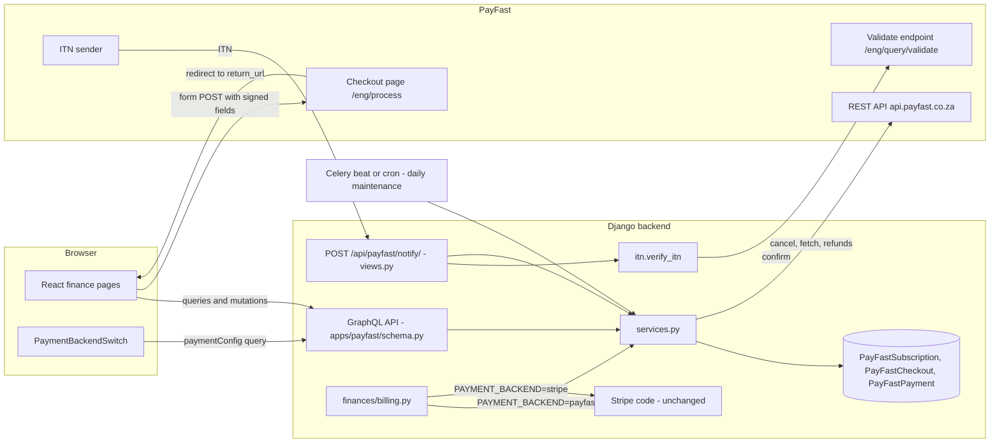
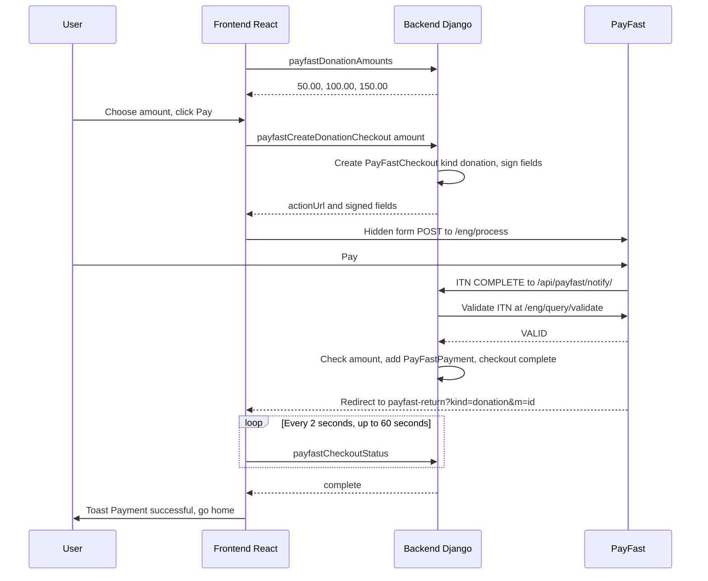
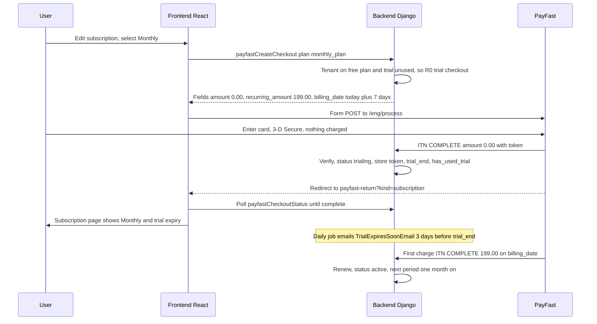
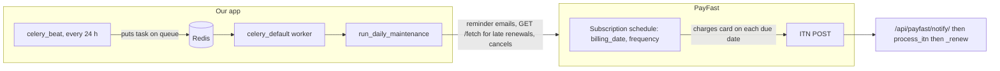
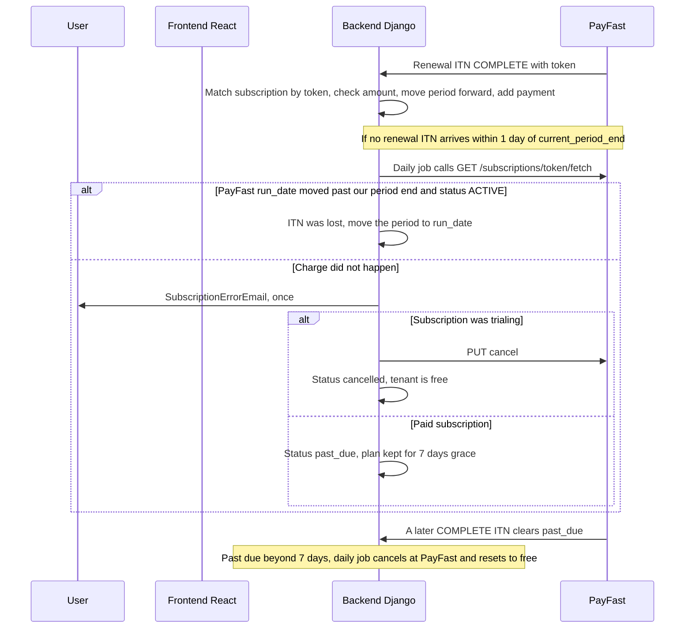
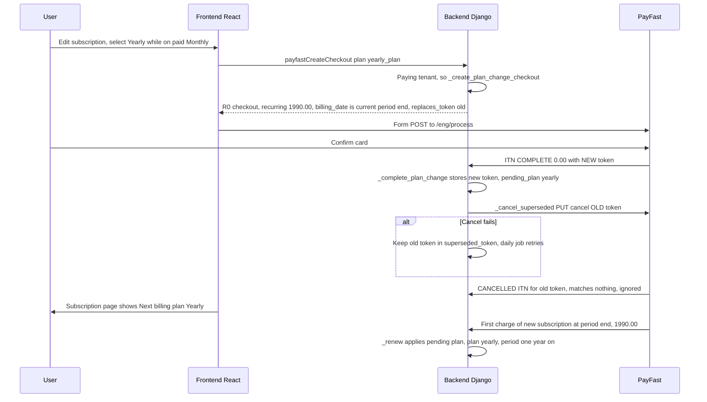
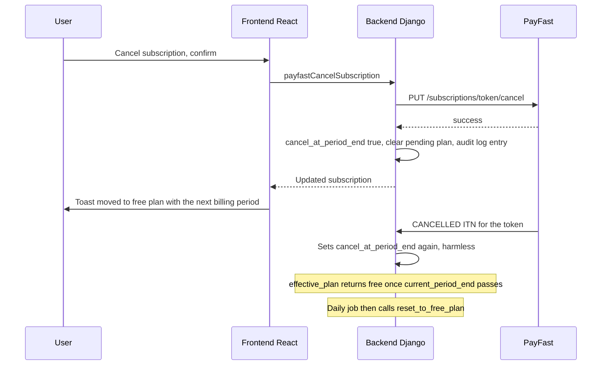

# PayFast payments: code walkthrough

This document explains how the PayFast payment feature works in the code as it stands on branch
`feat/payfast-payment-backend` (2026-10-01). It is not a design proposal. PayFast runs alongside the
original Stripe integration. One setting, `PAYMENT_BACKEND`, picks the provider. The backend app
[`apps/payfast`](../../../packages/backend/apps/payfast/) keeps its own billing records, creates signed checkout forms and handles PayFast's ITNs
(Instant Transaction Notifications). The frontend swaps each Stripe finance page for a PayFast version
when the server says PayFast is active. Only ITNs change billing state. The browser never does. A daily
maintenance job covers what PayFast sends no event for: trial reminders, failed renewals and ended
subscriptions.

## How to read this document

- Paths are relative to the repository root. Backend paths under `packages/backend/` are sometimes
  shortened to `apps/...` or `config/...`.
- Section 2 gives a reading order through the files. Sections 3 and 4 show the big picture and the
  main flows. Sections 5 and 6 go file by file, in the same order as section 2.
- PayFast background (why each rule exists) is in
  [`docs/superpowers/plans/2026-09-30-payfast-payment-backend-plan.md`](../plans/2026-09-30-payfast-payment-backend-plan.md): section 1 for PayFast facts, section 2 for
  target behaviour, section 10 for what was built and where it differs from the plan. Where the plan and the
  code disagree, the code is right and this document describes the code.
- PayFast docs: https://developers.payfast.co.za/docs and https://developers.payfast.co.za/api

## 1. Suggested reading order

Start here:

1. [`packages/backend/config/settings.py`](../../../packages/backend/config/settings.py) (the `PAYMENT_BACKEND` and `PAYFAST_*` block). This is the
   switch, and it shows how the sandbox or live credentials are chosen.
2. [`apps/finances/billing.py`](../../../packages/backend/apps/finances/billing.py) and [`apps/finances/signals.py`](../../../packages/backend/apps/finances/signals.py). These are the only places shared code
   asks "Stripe or PayFast?".
3. [`apps/payfast/constants.py`](../../../packages/backend/apps/payfast/constants.py). Plans, prices, frequencies and PayFast URLs. Everything later uses
   these names.
4. [`apps/payfast/signature.py`](../../../packages/backend/apps/payfast/signature.py). The three MD5 signatures. Most PayFast bugs show up here.
5. [`apps/payfast/models.py`](../../../packages/backend/apps/payfast/models.py). The three tables, and `effective_plan()`, which decides what a tenant
   has right now.
6. [`apps/payfast/services.py`](../../../packages/backend/apps/payfast/services.py), the checkout part (`create_subscription_checkout`,
   `_create_plan_change_checkout`, `create_donation_checkout`). How a signed form is built.
7. [`apps/payfast/views.py`](../../../packages/backend/apps/payfast/views.py) and [`apps/payfast/itn.py`](../../../packages/backend/apps/payfast/itn.py). How an incoming ITN is checked before anything
   trusts it.
8. [`apps/payfast/services.py`](../../../packages/backend/apps/payfast/services.py), `process_itn` and its helpers. The state machine: what each ITN does.
9. [`apps/payfast/schema.py`](../../../packages/backend/apps/payfast/schema.py). The GraphQL surface the web app uses, with its permissions.
10. [`packages/webapp-libs/webapp-finances/src/payfast/paymentBackendSwitch.component.tsx`](../../../packages/webapp-libs/webapp-finances/src/payfast/paymentBackendSwitch.component.tsx) and
    [`src/routes/index.tsx`](../../../packages/webapp-libs/webapp-finances/src/routes/index.tsx). How the web app picks Stripe or PayFast pages.
11. [`src/payfast/routes/editSubscription.component.tsx`](../../../packages/webapp-libs/webapp-finances/src/payfast/routes/editSubscription.component.tsx), [`subscriptionPlanItem.component.tsx`](../../../packages/webapp-libs/webapp-finances/src/payfast/routes/subscriptionPlanItem.component.tsx) and
    [`paymentConfirm.component.tsx`](../../../packages/webapp-libs/webapp-finances/src/payfast/routes/paymentConfirm.component.tsx). The pages that start a checkout.
12. [`src/payfast/routes/payfastReturn.component.tsx`](../../../packages/webapp-libs/webapp-finances/src/payfast/routes/payfastReturn.component.tsx). The page PayFast sends the buyer back to. It only
    polls.
13. [`apps/payfast/services.py`](../../../packages/backend/apps/payfast/services.py), `run_daily_maintenance`, then [`tasks.py`](../../../packages/backend/apps/payfast/tasks.py), the management commands
    and [`admin.py`](../../../packages/backend/apps/payfast/admin.py). The safety net and the operator tools.

End here: the tests in [`apps/payfast/tests/`](../../../packages/backend/apps/payfast/tests/) (the smoke test [`test_smoke.py`](../../../packages/backend/apps/payfast/tests/test_smoke.py) replays the whole journey).

## 2. Architecture overview



How the switch fits:

- `PAYMENT_BACKEND` is read once in [`config/settings.py`](../../../packages/backend/config/settings.py). `STRIPE_ENABLED` is forced off when it is
  `payfast`, which disables every Stripe code path guarded by that flag.
- `apps.payfast` is always installed and its GraphQL types are always in the schema. The mutations
  refuse to act unless PayFast is active, and the ITN view returns 404.
- The web app asks the server at runtime (`paymentConfig { backend }`), so one frontend build works
  with either backend.

## 3. Main flows

Participants in every diagram: User, Frontend (React), Backend (Django), PayFast.

### 3a. Once-off donation



The donation amount must be one of `PAYFAST_DONATION_AMOUNTS`. The ITN is matched to our
`PayFastCheckout` by `m_payment_id`, and the expected amount comes from that record, never from the ITN.
The return page only waits for the ITN's result.

### 3b. Subscription sign-up with free trial



The trial is once per tenant (`has_used_trial`). A tenant that already used it gets a checkout that
charges the full price straight away, with `status=active` after the ITN. The R0 ITN is stored as a
payment row, but `payfastPayments` hides zero amounts, so it does not show in the history.

#### Who charges the card after the trial: PayFast, not our app

Our app never charges a card and has no timer waiting 7 days. When the user signs up, we tell PayFast the whole schedule
once, in the checkout form. [`create_subscription_checkout`](../../../packages/backend/apps/payfast/services.py) sends
these fields (shown for Monthly with the default prices):

```python
{
    "amount": "0.00",            # charged today: nothing, the card is only saved
    "subscription_type": "1",    # 1 = a recurring subscription
    "recurring_amount": "199.00",
    "frequency": "3",            # 3 = monthly, 6 = annual
    "cycles": "0",               # 0 = keep charging until cancelled
    "billing_date": "2026-10-08",  # today + SUBSCRIPTION_TRIAL_PERIOD_DAYS (7)
}
```

PayFast stores the schedule on its side. On `billing_date` it charges the saved card, then again every month (or year).
After each successful charge it POSTs an ITN to `/api/payfast/notify/`. Our
[`process_itn`](../../../packages/backend/apps/payfast/services.py) matches the ITN by its `token` and calls `_renew`,
which records the payment and moves `current_period_end` forward. So we only _react_ to charges. We never start them.

Celery is still used, but only as a daily safety net, not to charge anyone:



- **celery_beat** is a clock. It reads `CELERY_BEAT_SCHEDULE` in
  [`config/settings.py`](../../../packages/backend/config/settings.py) and, every 24 hours, puts the
  `daily_maintenance` task on the queue. The entry exists only when `PAYMENT_BACKEND=payfast`:

  ```python
  CELERY_BEAT_SCHEDULE["payfast-daily-maintenance"] = {
      "task": "apps.payfast.tasks.daily_maintenance",
      "schedule": 60 * 60 * 24,  # Every 24 hours (in seconds)
  }
  ```

- **Redis** is the queue (the "broker"). It just holds the task until a worker takes it.
- **celery_default** is the worker. It runs [`tasks.daily_maintenance`](../../../packages/backend/apps/payfast/tasks.py),
  which calls [`run_daily_maintenance`](../../../packages/backend/apps/payfast/services.py). That function sends the
  "trial ends in 3 days" email, asks PayFast (`/fetch`) about renewals whose ITN is late, retries cancelling replaced
  subscriptions, and ends subscriptions that were cancelled or stayed unpaid too long.

If the daily job doesn't run, customers are still charged on time, because PayFast does the charging. What you lose is the
reminder emails and the late-ITN checks. Where Celery isn't available (for example a free Render plan with no worker),
run the same job from a daily cron:

```bash
python manage.py payfast_daily_maintenance
```

### 3c. Recurring renewal and the daily safety net



PayFast sends no ITN when a charge fails. It retries the charge itself and eventually locks the
subscription. So the daily job asks PayFast with `/fetch` whenever an expected renewal is late.
`effective_plan()` already applies the 7-day grace on read, so the job does not have to run on time.

### 3d. Plan change (monthly to yearly)



PayFast's update API (`PATCH /subscriptions/:token/update`) is not used, because it fails in the
sandbox (plan section 10). Instead the switch is a new R0 subscription that starts billing when the current
paid period (or trial) ends. The paid period carries on unchanged, so nobody pays twice for the same
period.

### 3e. Cancellation



PayFast stops charging at once, but the tenant keeps the paid plan until `current_period_end`, as with
Stripe. A cancellation made by the buyer or in the PayFast dashboard arrives only as the CANCELLED ITN
and has the same effect.

## 4. Backend walkthrough

### [`packages/backend/config/settings.py`](../../../packages/backend/config/settings.py)

Defines the switch and all PayFast settings. They are always defined, so PayFast code can import them
whichever backend is active.

- `PAYMENT_BACKEND`: `payfast` (default) or `stripe`, from the env var of the same name. A Stripe
  deployment must set `PAYMENT_BACKEND=stripe` explicitly.
- `STRIPE_ENABLED`: true only when the backend is Stripe and Stripe keys are set.
- `PAYFAST_ENVIRONMENT` / `PAYFAST_SANDBOX`: an `ENVIRONMENT_NAME` of `production` means live PayFast.
  Anything else means sandbox. So a non-production deployment can never take real money.
- `PAYFAST_MERCHANT_ID`, `_MERCHANT_KEY`, `_PASSPHRASE`, `_NOTIFY_URL`: read from
  `<NAME>_DEVELOPMENT` or `<NAME>_PRODUCTION`, picked by the environment above:

```python
PAYMENT_BACKEND = env("PAYMENT_BACKEND", default=PAYMENT_BACKEND_PAYFAST)

PAYFAST_ENVIRONMENT = "production" if ENVIRONMENT_NAME == "production" else "development"
PAYFAST_SANDBOX = PAYFAST_ENVIRONMENT != "production"
_PAYFAST_SUFFIX = PAYFAST_ENVIRONMENT.upper()
PAYFAST_MERCHANT_ID = env(f"PAYFAST_MERCHANT_ID_{_PAYFAST_SUFFIX}", default="")
```

- `PAYFAST_VERIFY_SOURCE_IP`, `PAYFAST_MONTHLY_PRICE`, `PAYFAST_YEARLY_PRICE`,
  `PAYFAST_DONATION_AMOUNTS`: one value each, with defaults 199.00, 1990.00 and 50/100/150.
- dj-stripe's API-key checks are silenced when PayFast is active.
- The daily task is added to `CELERY_BEAT_SCHEDULE` only when the backend is PayFast. `apps.payfast` is
  in `INSTALLED_APPS` unconditionally.

```python
if PAYMENT_BACKEND == PAYMENT_BACKEND_PAYFAST:
    CELERY_BEAT_SCHEDULE["payfast-daily-maintenance"] = {
        "task": "apps.payfast.tasks.daily_maintenance",
        "schedule": 60 * 60 * 24,  # Every 24 hours (in seconds)
    }
```

### [`packages/backend/apps/finances/billing.py`](../../../packages/backend/apps/finances/billing.py)

A small dispatcher for the billing actions that non-payment code needs, so callers don't care which
provider is active.

- `is_payfast()`: compares `PAYMENT_BACKEND` with `"payfast"`.
- `initialize_tenant(tenant)`: puts a new tenant on the free plan (local record for PayFast, Stripe
  schedule otherwise).
- `cancel_tenant_subscription(tenant)`: stops billing for a deleted tenant. The Stripe branch is the
  code previously inline in `DeleteTenantMutation`, unchanged.

### [`packages/backend/apps/finances/signals.py`](../../../packages/backend/apps/finances/signals.py) (PayFast branch)

- `create_free_plan_subscription`: on `post_save` of a new `Tenant`, with PayFast active, calls
  `billing.initialize_tenant` and returns before the Stripe code runs.

### [`packages/backend/apps/multitenancy/schema.py`](../../../packages/backend/apps/multitenancy/schema.py)

- `DeleteTenantMutation`: now calls `billing.cancel_tenant_subscription(tenant)` inside its existing
  try/except. Errors are logged and don't block the deletion.

### [`packages/backend/config/schema.py`](../../../packages/backend/config/schema.py) and [`config/urls_api.py`](../../../packages/backend/config/urls_api.py)

- `payfast_schema.Query` and `payfast_schema.Mutation` are added to the root schema.
- One line in the API URLs mounts the ITN endpoint at `/api/payfast/notify/`:

```python
path("payfast/", include("apps.payfast.urls")),
```

### [`apps/payfast/apps.py`](../../../packages/backend/apps/payfast/apps.py)

- `PayfastConfig.ready()`: registers `check_payfast_settings` as a Django system check.

### [`apps/payfast/checks.py`](../../../packages/backend/apps/payfast/checks.py)

System checks that run on every [`manage.py`](../../../packages/backend/manage.py) command and at server start, so a misconfigured
deployment fails at startup rather than at the first payment.

- `check_payfast_settings`: `payfast.E001` unknown `PAYMENT_BACKEND`. Then, only for PayFast:
  `E002` missing credential (it names the suffixed env var), `E003` notify URL is not `https://`,
  `E004` bad plan price, `E005` bad donation amounts.
- `is_valid_amount(value)`: a decimal of at least 5.00 with at most two decimals (PayFast's minimum).

### [`apps/payfast/constants.py`](../../../packages/backend/apps/payfast/constants.py)

Plans, prices and URLs. Values that depend on settings are functions, so `override_settings` and env
changes are always picked up.

- `CURRENCY` and `Frequency`, PayFast's billing-frequency codes:

```python
CURRENCY = "ZAR"  # PayFast only supports South African rand.


class Frequency(models.IntegerChoices):
    MONTHLY = 3, "Monthly"
    ANNUAL = 6, "Annual"
```

- `PayFastPlan` (name, amount, frequency, `is_paid`) and `plan_prices()`: free, monthly and yearly,
  using the plan names shared with Stripe ([`apps/finances/constants.py`](../../../packages/backend/apps/finances/constants.py)).
- `get_paid_plan(name)`: raises `UnknownPlanError` for the free plan or unknown names.
- `donation_amounts()`, `trial_period_days()`, `to_amount()`.
- `process_url()`, `validate_url()`: sandbox or live host. `API_BASE_URL` is the same for both.
- `card_update_url(token, return_url)`: PayFast's hosted card-update page (live host only).
- `VALID_ITN_HOSTS`, `PUBLISHED_IP_NETWORKS`, `is_published_payfast_ip(ip)`: where ITNs may come from.

### [`apps/payfast/signature.py`](../../../packages/backend/apps/payfast/signature.py)

Pure functions for PayFast's three MD5 signatures. Values are encoded like PHP's `urlencode()` (spaces
as `+`, upper-case escapes, `~` as `%7E`).

- `CHECKOUT_FIELD_ORDER`: every checkout field in the order the docs list them.
- `checkout_signature(fields, passphrase)`: non-blank fields in documented order, plus the passphrase.
  Raises for an undocumented field.
- `parse_itn_body(raw_body)`, `itn_param_string(pairs)`, `itn_signature_is_valid(pairs, passphrase)`:
  fields in the order PayFast posted them, blanks kept, up to `signature`.
- `api_signature(headers, body, passphrase)`: everything plus the passphrase, sorted alphabetically,
  with `testing` left out.

### [`apps/payfast/client.py`](../../../packages/backend/apps/payfast/client.py)

`PayFastApiClient`, a thin client for `https://api.payfast.co.za`. It signs every call and adds
`?testing=true` in the sandbox.

- `fetch(token)`: subscription state. Used by the daily job for overdue renewals.
- `cancel(token)`: cancels a subscription. PayFast then sends a CANCELLED ITN.
- `update(token, ...)`: exists but is unused (plan changes go through checkout, see 3d).
- `refund_query(pf_payment_id)`, `refund_create(...)`: used by the admin refund page. These don't work
  in the sandbox.
- `_request`: builds headers and signature, and raises `PayFastApiError` on network errors, non-JSON
  replies (it strips PayFast's HTML error page into a short message), HTTP 4xx/5xx or
  `status != "success"`.

### [`apps/payfast/itn.py`](../../../packages/backend/apps/payfast/itn.py)

Security checks run on an ITN before anything acts on it.

- `verify_itn(request)`: runs the checks in this order: signature, `merchant_id`, source IP (if
  `PAYFAST_VERIFY_SOURCE_IP`), then server confirmation. It returns ordered pairs or raises
  `ItnRejected`. The amount check comes later, in [`services`](../../../packages/backend/apps/payfast/services.py).
- `client_ip(request)`: uses the last `X-Forwarded-For` entry (the one the proxy appended), otherwise
  `REMOTE_ADDR`.
- `source_is_payfast(ip)`: published ranges, or the resolved PayFast hosts.
- `confirm_with_payfast(param_string)`: POSTs to `/eng/query/validate` and expects `VALID`. Any error
  counts as no.

### [`apps/payfast/models.py`](../../../packages/backend/apps/payfast/models.py) and [`migrations/`](../../../packages/backend/apps/payfast/migrations/)

Our own billing state. PayFast has no object API to mirror, so there is no equivalent of dj-stripe.

- `PayFastSubscription`: one per tenant (`OneToOne`). It holds the `plan`, `pending_plan` and
  `pending_amount`, the `status` (active, trialing, past_due, cancelled), the `token`, `amount` and
  `frequency`, the period and trial dates, `has_used_trial`, two email-sent timestamps,
  `cancel_at_period_end` and `superseded_token`.
- `PayFastSubscription.effective_plan(now)`: returns free when the plan is free or the status is
  cancelled, when the subscription was cancelled and the period has ended, or when it is past due for
  more than `PAST_DUE_GRACE_DAYS` (7). Otherwise it returns `plan`. `subscriber` lets the Stripe
  emails work unchanged.
- `PayFastCheckout`: one per checkout we start. The `m_payment_id` (UUID) is how ITNs find it. It
  records the kind, tenant, plan, expected `amount`, `recurring_amount`, `is_trial`, `replaces_token`
  (for plan changes) and `status` (pending, complete).
- `PayFastPayment`: one per ITN we accepted. `pf_payment_id` is unique, which makes a repeated ITN a
  no-op. It holds the amounts, `refunded_amount` and the raw payload.
- [`0001_initial.py`](../../../packages/backend/apps/payfast/migrations/0001_initial.py) creates the three tables. [`0002_plan_change_by_checkout.py`](../../../packages/backend/apps/payfast/migrations/0002_plan_change_by_checkout.py) adds `replaces_token`
  and `superseded_token`.

### [`apps/payfast/services.py`](../../../packages/backend/apps/payfast/services.py), checkouts

- `get_subscription(tenant)` / `initialize_tenant(tenant)`: get or create the free-plan record.
- `create_subscription_checkout(tenant, user, plan_name, return_url, cancel_url)`: called by
  `payfastCreateCheckout`. It sends a paying tenant to `_create_plan_change_checkout`. Otherwise it
  creates a subscription checkout: R0 with `billing_date = today + trial days` if the trial is unused,
  else the full price now.
- `_create_plan_change_checkout(...)`: refuses if the subscription was cancelled, has no token or
  period end yet, or the plan is already current or pending. Otherwise it creates an R0 checkout with
  `billing_date` = current period end and `replaces_token` = the old token.
- `create_donation_checkout(...)`: accepts only the configured amounts. It is a once-off payment, with
  no subscription fields.
- `_base_fields`, `_signed_form`: the shared merchant fields. They add `m=<m_payment_id>` to the
  return URL (the return page needs it), drop blanks and sign. They return a `CheckoutForm`
  (`action_url`, `fields`, `m_payment_id`).
- `next_period_end(start, frequency)`: one calendar month or year later. The day is clamped, so 31 Jan
  becomes 28/29 Feb.

### [`apps/payfast/views.py`](../../../packages/backend/apps/payfast/views.py) and [`urls.py`](../../../packages/backend/apps/payfast/urls.py)

- `itn_view` at `POST /api/payfast/notify/` (name `payfast-itn`): CSRF-exempt and POST only. It
  returns 404 unless PayFast is active. It runs `itn.verify_itn` then `services.process_itn`. An
  `ItnRejected` returns 400, so PayFast retries. Anything else processed, including duplicate and
  ignored ITNs, returns 200 `OK`.

### [`apps/payfast/services.py`](../../../packages/backend/apps/payfast/services.py), ITN processing

- `process_itn(data)`: runs inside one transaction with row locks. It returns `DUPLICATE` if the
  `pf_payment_id` was already stored. Then: a CANCELLED ITN for a known token goes to
  `_apply_cancelled_itn`. A COMPLETE ITN for a pending checkout goes to `_complete_donation` or
  `_complete_subscription_checkout`. A COMPLETE ITN for a known token goes to `_renew`. Anything else
  is `IGNORED`.
- `_check_amount(expected, data)`: PayFast's check 3. `amount_gross` must be within 0.01 of what we
  expected, or it raises `ItnRejected`.
- `_complete_subscription_checkout`: first subscription. It sets plan, token, amount and frequency,
  then either trialing with `trial_end` or active with a one-period end. For a checkout with
  `replaces_token` it hands over to `_complete_plan_change`.
- `_complete_plan_change`: stores the new token and sets `pending_plan` and `pending_amount`. The
  period is not touched. Then it calls `_cancel_superseded(old_token)`.
- `_cancel_superseded(subscription, old_token)`: `PUT cancel` on the old token. On failure it keeps
  the token in `superseded_token` for the daily retry.
- `_renew(subscription, data)`: a recurring charge. It expects `pending_amount` if a change is
  pending, applies the pending plan, moves the period forward from the old end, and sets status active
  (which also clears past_due).
- `_apply_cancelled_itn`: sets `cancel_at_period_end` and clears any pending change.
- `_record_payment`: writes the `PayFastPayment` row (skipped if there is no `pf_payment_id`).

### [`apps/payfast/services.py`](../../../packages/backend/apps/payfast/services.py), cancellation, refunds and maintenance

- `cancel_subscription(tenant)`: called by `payfastCancelSubscription`. Calls `PUT cancel` (once), sets
  `cancel_at_period_end`, also retries any `superseded_token`, and clears the pending plan. API
  failure becomes a user-visible `PayFastError`.
- `cancel_tenant_subscription_immediately(tenant)`: for tenant deletion. It cancels both the current
  and superseded tokens, logs errors and sets status cancelled.
- `card_update_url(subscription, return_url)`: `None` without a token.
- `reset_to_free_plan(subscription)`: back to free, keeping `has_used_trial`.
- `get_refund_options(payment)` / `refund_payment(payment, amount, reason)`: query first. Only
  `PAYMENT_SOURCE` refunds are made here (bank payouts go through the PayFast dashboard). Adds to
  `refunded_amount`.
- `run_daily_maintenance()`: (0) retry superseded cancels. (1) Trial reminder 3 days before
  `trial_end`, once. (2) Overdue renewals, more than a day past `current_period_end`, go to
  `_check_overdue_renewal`. (3) Reset ended cancelled subscriptions to free. (4) Cancel and reset
  subscriptions past due beyond grace. Returns counts.
- `_check_overdue_renewal(subscription)`: uses `/fetch`. If the status is ACTIVE and the run date
  moved past our period end, it catches up the period. Otherwise it sends `SubscriptionErrorEmail`
  once, then cancels a trialing subscription or marks a paid one past_due.

### [`apps/payfast/schema.py`](../../../packages/backend/apps/payfast/schema.py)

The GraphQL API. It is always in the schema. Mutations call `require_payfast()`. Return and cancel
paths must be same-site relative paths (`web_app_url`), so a caller can't redirect buyers off-site.
`request_tenant` checks the `tenantId` against the request's tenant.

Queries:

- `paymentConfig { backend currency }`: anyone. This drives the frontend switch.
- `payfastSubscriptionPlans`, `payfastDonationAmounts`: anyone. ZAR prices from settings.
- `payfastActiveSubscription(tenantId)`: tenant member with `billing.view`. Includes
  `effectivePlan`, `pendingPlan`, dates, `canActivateTrial`, `hasCard`, `cardUpdateUrl(returnPath)`.
- `payfastPayments(tenantId)`: `billing.view`. A relay connection of COMPLETE payments with amount
  above 0 (no R0 trial or plan-change starts, no cancel notices).
- `payfastCheckoutStatus(tenantId, mPaymentId)`: `billing.view`. Returns `pending`, `complete` or
  null. Polled by the return page.

Mutations (all need tenant membership plus `billing.manage`):

- `payfastCreateCheckout(tenantId, plan, returnPath, cancelPath)`: a new subscription or a plan
  change. Returns `checkout { actionUrl fields mPaymentId }`.
- `payfastCreateDonationCheckout(tenantId, amount, returnPath, cancelPath)`: a donation, with the same
  payload.
- `payfastCancelSubscription(tenantId)`: returns `activeSubscription` and writes the same audit entry
  as the Stripe cancel.

### [`apps/payfast/tasks.py`](../../../packages/backend/apps/payfast/tasks.py)

- `daily_maintenance`: a Celery `shared_task` that calls `services.run_daily_maintenance()`. It does
  nothing if the backend has since been switched back to Stripe.

### [`apps/payfast/admin.py`](../../../packages/backend/apps/payfast/admin.py) and [`templates/admin/payfast/refund.html`](../../../packages/backend/apps/payfast/templates/admin/payfast/refund.html)

- `PayFastSubscriptionAdmin`, `PayFastCheckoutAdmin`, `PayFastPaymentAdmin`: list, filter and search
  views.
- `PayFastPaymentAdmin.refund_view` (at `<id>/refund/`): shows PayFast's refundable amount and
  method, and takes an amount plus a reason of 3 to 255 characters. It calls
  `services.refund_payment`. The template renders the options, errors and form.

### [`apps/payfast/management/commands/`](../../../packages/backend/apps/payfast/management/commands/)

- `payfast_daily_maintenance`: the same job as the Celery task, for cron-only deployments. Prints
  the counts.
- `payfast_init_tenants`: gives existing tenants a free-plan record after switching a deployment to
  PayFast. Safe to re-run.
- `payfast_seed_demo`: adds two example payments (`seed-` ids) to each organisation the user owns, for
  checking the history page by hand. It never contacts PayFast.

Run them in the backend container:

```bash
docker compose run --rm backend python manage.py payfast_daily_maintenance
docker compose run --rm backend python manage.py payfast_init_tenants
docker compose run --rm backend python manage.py payfast_seed_demo --email <your-email>
```

## 5. Frontend walkthrough

All paths are under [`packages/webapp-libs/webapp-finances/src/`](../../../packages/webapp-libs/webapp-finances/src/) unless stated.

### [`payfast/payfast.graphql.ts`](../../../packages/webapp-libs/webapp-finances/src/payfast/payfast.graphql.ts)

The GraphQL documents: `paymentConfigQuery`, `payfastActiveSubscriptionQuery`,
`payfastCardUpdateUrlQuery`, `payfastSubscriptionPlansQuery`, `payfastDonationAmountsQuery`,
`payfastPaymentsQuery`, `payfastCheckoutStatusQuery`, and the three mutations
(`payfastCreateCheckoutMutation`, `payfastCreateDonationCheckoutMutation`,
`payfastCancelSubscriptionMutation`). Types are generated into `webapp-api-client`.

### [`payfast/usePaymentBackend.hook.ts`](../../../packages/webapp-libs/webapp-finances/src/payfast/usePaymentBackend.hook.ts)

- `usePaymentBackend()`: returns `'stripe'`, `'payfast'`, or `undefined` while loading. It falls
  back to Stripe only if the request fails (the server itself answers `payfast` by default). The
  boilerplate's Stripe page tests rely on that fallback, because they don't mock `paymentConfig`.

### [`payfast/paymentBackendSwitch.component.tsx`](../../../packages/webapp-libs/webapp-finances/src/payfast/paymentBackendSwitch.component.tsx)

- `PaymentBackendSwitch({ stripe, payfast })`: renders one of the two, and nothing until the backend
  is known, so no Stripe query runs on a PayFast deployment.
- `withPaymentBackend(Stripe, Payfast)`: wraps two route components into one, so the route
  definitions don't change.

### [`routes/index.tsx`](../../../packages/webapp-libs/webapp-finances/src/routes/index.tsx) and [`config/routes.ts`](../../../packages/webapp-libs/webapp-finances/src/config/routes.ts)

- Every exported finance route (`PaymentConfirm`, `Subscriptions`, `EditSubscription`,
  `EditPaymentMethod`, `CancelSubscription`, `TransactionHistory`, and the three tab contents) is now
  `withPaymentBackend(stripePage, payfastPage)`. On PayFast, `EditPaymentMethod` reuses the payment
  method tab.
- `PayfastReturn`: PayFast-only route, registered in the finances route config:

```ts
finances: nestedPath('finances', {
  paymentConfirm: 'payment-confirm',
  // Where PayFast sends the buyer back after paying (PayFast checkouts only).
  payfastReturn: 'payfast-return',
}),
```

Each exported route wraps the Stripe page and its PayFast counterpart, for example:

```ts
export const PaymentConfirm = withPaymentBackend(
  asyncComponent(() => import('./paymentConfirm')),
  asyncComponent(() => import('../payfast/routes/paymentConfirm.component')),
);
```

### [`packages/webapp/src/app/app.component.tsx`](../../../packages/webapp/src/app/app.component.tsx)

- The billing routes' `ActiveSubscriptionContext`, which loads Stripe data, is used only for Stripe.
- Adds the `finances.payfastReturn` route inside the `billing.view` guard.

```tsx
<Route element={<PaymentBackendSwitch stripe={<ActiveSubscriptionContext />} payfast={<Outlet />} />}>
  {/* ...the subscription routes, unchanged... */}
</Route>
<Route path={RoutesConfig.finances.paymentConfirm} element={<PaymentConfirm />} />
<Route path={RoutesConfig.finances.payfastReturn} element={<PayfastReturn />} />
```

### [`payfast/submitPayfastCheckout.ts`](../../../packages/webapp-libs/webapp-finances/src/payfast/submitPayfastCheckout.ts)

- `submitPayfastCheckout({ actionUrl, fields })`: builds a hidden form, adds the signed fields
  unchanged and submits it. This is how the browser goes to PayFast.

### [`payfast/usePayfastSubscription.hook.ts`](../../../packages/webapp-libs/webapp-finances/src/payfast/usePayfastSubscription.hook.ts), [`useFormatZar.hook.ts`](../../../packages/webapp-libs/webapp-finances/src/payfast/useFormatZar.hook.ts), [`payfastErrorMessage.ts`](../../../packages/webapp-libs/webapp-finances/src/payfast/payfastErrorMessage.ts)

- `usePayfastSubscription()`: the current tenant's subscription, `isPaid` (effective plan is not
  free), `loading` and `tenantId`.
- `useFormatZar()`: formats a Decimal string as ZAR in the user's locale.
- `payfastErrorMessage(error, fallback)`: takes the reason from `extensions.non_field_errors`, and
  never shows the bare error class name.

### [`payfast/routes/subscriptions.component.tsx`](../../../packages/webapp-libs/webapp-finances/src/payfast/routes/subscriptions.component.tsx)

- `PayfastSubscriptions`: the subscription page layout with three tabs (current, payment methods,
  history). Unlike the Stripe layout, it loads no data itself.

### [`payfast/routes/currentSubscription.content.tsx`](../../../packages/webapp-libs/webapp-finances/src/payfast/routes/currentSubscription.content.tsx)

- `PayfastCurrentSubscriptionContent`: shows the plan name and ZAR price, next renewal or expiry date
  (once cancelled), next billing plan (pending change) and trial expiry. Edit and Cancel buttons need
  `billing.manage`, and Cancel only shows on an active paid plan.

### [`payfast/routes/editSubscription.component.tsx`](../../../packages/webapp-libs/webapp-finances/src/payfast/routes/editSubscription.component.tsx) and [`subscriptionPlanItem.component.tsx`](../../../packages/webapp-libs/webapp-finances/src/payfast/routes/subscriptionPlanItem.component.tsx)

- `PayfastEditSubscription`: lists the three plans. `selectPlan` calls `payfastCreateCheckout` with
  return path `payfast-return?kind=subscription`, then `submitPayfastCheckout`. The same mutation
  serves sign-up and plan change; the server decides which. The yearly saving percentage is
  calculated from the env prices.
- `PayfastSubscriptionPlanItem`: a copy of the Stripe plan card. States are Current plan, Scheduled
  (pending plan, or Free after cancelling) and Select plan. Free is never selectable. The "Start with
  a free trial" notice shows only while on Free with the trial unused.

### [`payfast/routes/cancelSubscription.component.tsx`](../../../packages/webapp-libs/webapp-finances/src/payfast/routes/cancelSubscription.component.tsx)

- `PayfastCancelSubscription`: plan details and a confirm dialog that calls
  `payfastCancelSubscription`. It refetches the subscription, shows the Stripe success message and
  goes back. Errors show the server's reason.

### [`payfast/routes/paymentMethod.content.tsx`](../../../packages/webapp-libs/webapp-finances/src/payfast/routes/paymentMethod.content.tsx)

- `PayfastPaymentMethodContent`: says the card is stored by PayFast, or shows the empty state. Its
  "Update card" link to PayFast's hosted page needs `billing.manage`. It only works on live PayFast.

### [`payfast/routes/transactionsHistory.content.tsx`](../../../packages/webapp-libs/webapp-finances/src/payfast/routes/transactionsHistory.content.tsx) and [`transactionHistory.component.tsx`](../../../packages/webapp-libs/webapp-finances/src/payfast/routes/transactionHistory.component.tsx)

- `PayfastTransactionsHistoryContent`: the history tab. It shows an empty state, or a link to the full
  page.
- `PayfastTransactionHistory`: the full table, with Stripe's labels ("Donation", "{plan} plan").
  Payment method always reads "PayFast".

### [`payfast/routes/paymentConfirm.component.tsx`](../../../packages/webapp-libs/webapp-finances/src/payfast/routes/paymentConfirm.component.tsx)

- `PayfastPaymentConfirm`: the donation page. A radio picker of `payfastDonationAmounts`, then "Pay
  R…" calls `payfastCreateDonationCheckout` (return path `payfast-return?kind=donation`) and submits
  to PayFast.

### [`payfast/routes/payfastReturn.component.tsx`](../../../packages/webapp-libs/webapp-finances/src/payfast/routes/payfastReturn.component.tsx)

- `PayfastReturn`: reads `m` and `kind` from the URL, then polls `payfastCheckoutStatus` every 2
  seconds for up to 60 seconds. On `complete` it shows a "Payment successful" toast and goes home
  (donation) or to the subscription page. On timeout it says PayFast hasn't confirmed yet and that
  the user should not pay again.

### [`payfast/tests/fixtures.ts`](../../../packages/webapp-libs/webapp-finances/src/payfast/tests/fixtures.ts) and [`payfast/__tests__/`](../../../packages/webapp-libs/webapp-finances/src/payfast/__tests__/)

- [`fixtures.ts`](../../../packages/webapp-libs/webapp-finances/src/payfast/tests/fixtures.ts): Apollo mocks shaped like the backend responses (`fillPaymentConfigQuery`,
  `freeSubscription`, `monthlySubscription`, `fillPayfastPlansQuery`, `checkoutResponse`, ...).
- [`__tests__/`](../../../packages/webapp-libs/webapp-finances/src/payfast/__tests__/): one spec per page or helper (see section 6).

### [`packages/webapp-libs/webapp-api-client/graphql/schema/api.graphql`](../../../packages/webapp-libs/webapp-api-client/graphql/schema/api.graphql)

- Only additions: about 119 lines adding `PaymentConfigType`, the `PayFast*` types, the inputs and
  payloads, and the matching `Query` and `Mutation` fields. Generated [`gql.ts`](../../../packages/webapp-libs/webapp-api-client/src/graphql/__generated/gql/gql.ts) / [`graphql.ts`](../../../packages/webapp-libs/webapp-api-client/src/graphql/__generated/gql/graphql.ts) follow
  from it.

## 6. Tests

### Backend: [`packages/backend/apps/payfast/tests/`](../../../packages/backend/apps/payfast/tests/)

Unit tests (no network; the PayFast API is the `payfast_api` mock):

- [`test_constants.py`](../../../packages/backend/apps/payfast/tests/test_constants.py): plan prices from settings, frequencies, URLs, published IP ranges.
- [`test_signature.py`](../../../packages/backend/apps/payfast/tests/test_signature.py): the three signatures, checked against a Python port of PayFast's PHP reference.
- [`test_client.py`](../../../packages/backend/apps/payfast/tests/test_client.py): exact method, URL, headers, body and sandbox flag of each API call, plus error
  handling.
- [`test_itn.py`](../../../packages/backend/apps/payfast/tests/test_itn.py): each ITN check, `client_ip`, source checks, the validate call.
- [`test_checks.py`](../../../packages/backend/apps/payfast/tests/test_checks.py): each `payfast.E00x` system check.
- [`test_settings.py`](../../../packages/backend/apps/payfast/tests/test_settings.py): env vars are wired up, and `ENVIRONMENT_NAME` picks the credential set
  (subprocess-based).
- [`test_models.py`](../../../packages/backend/apps/payfast/tests/test_models.py): defaults, `effective_plan()` in every state, trial eligibility.
- [`test_services.py`](../../../packages/backend/apps/payfast/tests/test_services.py): checkouts, every ITN path (first payment, renewal, pending plan, past due,
  cancel, donation, duplicates), plan-change checkout and completion, cancellation, tenant deletion,
  daily maintenance, `next_period_end`.
- [`test_tasks.py`](../../../packages/backend/apps/payfast/tests/test_tasks.py): the Celery task, its beat entry, and the two maintenance commands.

Integration tests (real URLs, schema, database; only PayFast's servers and DNS are faked):

- [`test_views.py`](../../../packages/backend/apps/payfast/tests/test_views.py): `POST /api/payfast/notify/` status codes and an end-to-end subscription ITN.
- [`test_schema.py`](../../../packages/backend/apps/payfast/tests/test_schema.py): every query and mutation through `config.schema`, with permissions and path
  validation.
- [`test_admin.py`](../../../packages/backend/apps/payfast/tests/test_admin.py): admin pages load, and the refund flow works.

Smoke test:

- [`test_smoke.py`](../../../packages/backend/apps/payfast/tests/test_smoke.py): one tenant's whole journey: trial checkout, ITN over HTTP, switch to yearly,
  cancel, donation, history.

Helpers: [`fixtures.py`](../../../packages/backend/apps/payfast/tests/fixtures.py) (`payfast_backend` switches settings to PayFast for one test, `payfast_api`
mocks the client), [`factories.py`](../../../packages/backend/apps/payfast/tests/factories.py), [`utils.py`](../../../packages/backend/apps/payfast/tests/utils.py).

Elsewhere:

- [`apps/finances/tests/test_billing.py`](../../../packages/backend/apps/finances/tests/test_billing.py): the dispatcher sends to Stripe or PayFast, and
  `DeleteTenantMutation` uses it.
- [`apps/finances/tests/test_payment_backend_settings.py`](../../../packages/backend/apps/finances/tests/test_payment_backend_settings.py): the `PAYMENT_BACKEND` env var, and that
  `STRIPE_ENABLED` is off under PayFast.
- [`packages/backend/.test.env`](../../../packages/backend/.test.env) pins `PAYMENT_BACKEND=stripe`, because the boilerplate's Stripe tests expect it
  (the app's own default is PayFast), and so a developer's `.env` can't leak into tests. PayFast tests opt in with the `payfast_backend` fixture.

Run (from the repo root):

```bash
docker compose run --rm -T -e DATABASE_URL= backend pytest apps/payfast -v
```

`DATABASE_URL` must be blank so the tests use the local `db` container rather than a database
configured in your `.env`. To include the Stripe/PayFast switch tests:

```bash
docker compose run --rm -T -e DATABASE_URL= backend pytest apps/payfast apps/finances/tests/test_billing.py apps/finances/tests/test_payment_backend_settings.py -v
```

### Frontend: [`packages/webapp-libs/webapp-finances/src/payfast/__tests__/`](../../../packages/webapp-libs/webapp-finances/src/payfast/__tests__/)

- [`paymentBackendSwitch.component.spec.tsx`](../../../packages/webapp-libs/webapp-finances/src/payfast/__tests__/paymentBackendSwitch.component.spec.tsx): renders Stripe or PayFast, and nothing while loading.
- [`routes.spec.tsx`](../../../packages/webapp-libs/webapp-finances/src/payfast/__tests__/routes.spec.tsx): exported routes render the PayFast pages on a PayFast backend.
- [`submitPayfastCheckout.spec.ts`](../../../packages/webapp-libs/webapp-finances/src/payfast/__tests__/submitPayfastCheckout.spec.ts): posts every signed field unchanged.
- [`payfastErrorMessage.spec.ts`](../../../packages/webapp-libs/webapp-finances/src/payfast/__tests__/payfastErrorMessage.spec.ts): reason extraction and fallbacks.
- [`currentSubscription.content.spec.tsx`](../../../packages/webapp-libs/webapp-finances/src/payfast/__tests__/currentSubscription.content.spec.tsx): free, paid, trial, pending plan and cancelled views.
- [`editSubscription.component.spec.tsx`](../../../packages/webapp-libs/webapp-finances/src/payfast/__tests__/editSubscription.component.spec.tsx): plans in ZAR, sign-up checkout, plan-change checkout, server
  error.
- [`subscriptionPlanItem.component.spec.tsx`](../../../packages/webapp-libs/webapp-finances/src/payfast/__tests__/subscriptionPlanItem.component.spec.tsx): card content and button states.
- [`cancelSubscription.component.spec.tsx`](../../../packages/webapp-libs/webapp-finances/src/payfast/__tests__/cancelSubscription.component.spec.tsx): cancel after confirmation, and the free-plan state.
- [`paymentMethod.content.spec.tsx`](../../../packages/webapp-libs/webapp-finances/src/payfast/__tests__/paymentMethod.content.spec.tsx): card on file with Update link, and the empty state.
- [`transactionsHistory.content.spec.tsx`](../../../packages/webapp-libs/webapp-finances/src/payfast/__tests__/transactionsHistory.content.spec.tsx): the tab and the full history table labels.
- [`paymentConfirm.component.spec.tsx`](../../../packages/webapp-libs/webapp-finances/src/payfast/__tests__/paymentConfirm.component.spec.tsx): the donation picker sends the chosen amount.
- [`payfastReturn.component.spec.tsx`](../../../packages/webapp-libs/webapp-finances/src/payfast/__tests__/payfastReturn.component.spec.tsx): redirects on completion, keeps waiting while pending.

Run:

```bash
pnpm nx run webapp-finances:test --watchAll=false
```

## 7. Configuration

All variables are documented in [`packages/backend/.env.shared`](../../../packages/backend/.env.shared) (commented examples) and
[`packages/backend/.env.render.example`](../../../packages/backend/.env.render.example). Real values go in the untracked `packages/backend/.env` or
deployment secrets. They are read in [`config/settings.py`](../../../packages/backend/config/settings.py).

- `PAYMENT_BACKEND`: `payfast` (default) or `stripe`.
- `ENVIRONMENT_NAME`: `production` selects the `*_PRODUCTION` set and live PayFast. Anything else
  selects `*_DEVELOPMENT` and the sandbox.
- `PAYFAST_MERCHANT_ID_{DEVELOPMENT,PRODUCTION}`, `PAYFAST_MERCHANT_KEY_...`,
  `PAYFAST_PASSPHRASE_...` (must match the dashboard's Salt Passphrase), `PAYFAST_NOTIFY_URL_...`
  (public `https://.../api/payfast/notify/`; locally an ngrok URL).
- `PAYFAST_VERIFY_SOURCE_IP`: default `True`. Set it to `False` only behind a local tunnel.
- `PAYFAST_MONTHLY_PRICE`, `PAYFAST_YEARLY_PRICE`, `PAYFAST_DONATION_AMOUNTS`: ZAR, each at least 5.00.
- `SUBSCRIPTION_TRIAL_PERIOD_DAYS`: shared with Stripe (default 7).
- `WEB_APP_URL`: the base for return, cancel and card-update URLs (no PayFast-specific variable).
- For Celery deployments, set the same variables on the worker and beat services, so beat registers
  the daily task. Without Celery, run this once a day from cron:

```bash
python manage.py payfast_daily_maintenance
```

## 8. Where to change things

- Prices or donation amounts: env vars `PAYFAST_MONTHLY_PRICE`, `PAYFAST_YEARLY_PRICE`,
  `PAYFAST_DONATION_AMOUNTS`. Existing subscribers keep the amount agreed at checkout.
- Add a plan or billing frequency: [`apps/payfast/constants.py`](../../../packages/backend/apps/payfast/constants.py) (`plan_prices`, `Frequency`),
  `services.ITEM_NAMES`, `schema.INTERVALS`, and the shared plan names in
  [`apps/finances/constants.py`](../../../packages/backend/apps/finances/constants.py).
- Trial length: `SUBSCRIPTION_TRIAL_PERIOD_DAYS`. Reminder lead time: `services.TRIAL_REMINDER_LEAD_TIME`.
- Past-due grace: `PayFastSubscription.PAST_DUE_GRACE_DAYS`. Late-ITN tolerance:
  `services.RENEWAL_ITN_GRACE`.
- What a tenant "has": `PayFastSubscription.effective_plan()` in [`models.py`](../../../packages/backend/apps/payfast/models.py).
- ITN trust rules: [`apps/payfast/itn.py`](../../../packages/backend/apps/payfast/itn.py) (signature, merchant, source, validate). Amount rule and
  state changes: `services.process_itn` and its helpers.
- Plan-change behaviour: `services._create_plan_change_checkout`, `_complete_plan_change`,
  `_cancel_superseded`, `_renew`.
- Checkout fields sent to PayFast: `services._base_fields` and the dicts in the create functions. A
  new field must also be added to `signature.CHECKOUT_FIELD_ORDER` in the documented position.
- Daily job contents: `services.run_daily_maintenance`. Schedule: `CELERY_BEAT_SCHEDULE` in
  [`config/settings.py`](../../../packages/backend/config/settings.py).
- GraphQL fields and permissions: [`apps/payfast/schema.py`](../../../packages/backend/apps/payfast/schema.py). After changing them, update
  [`api.graphql`](../../../packages/webapp-libs/webapp-api-client/graphql/schema/api.graphql) and regenerate the client types.
- Plan card display: [`payfast/routes/subscriptionPlanItem.component.tsx`](../../../packages/webapp-libs/webapp-finances/src/payfast/routes/subscriptionPlanItem.component.tsx). Plan names: the shared
  [`hooks/useSubscriptionPlanDetails`](../../../packages/webapp-libs/webapp-finances/src/hooks/useSubscriptionPlanDetails/).
- Current plan details: [`payfast/routes/currentSubscription.content.tsx`](../../../packages/webapp-libs/webapp-finances/src/payfast/routes/currentSubscription.content.tsx).
- Return-page polling: `POLL_INTERVAL_MS` and `GIVE_UP_AFTER_MS` in [`payfastReturn.component.tsx`](../../../packages/webapp-libs/webapp-finances/src/payfast/routes/payfastReturn.component.tsx).
- Which page a route shows: [`routes/index.tsx`](../../../packages/webapp-libs/webapp-finances/src/routes/index.tsx) (`withPaymentBackend`).
- Refund rules: `services.refund_payment` and [`admin.py`](../../../packages/backend/apps/payfast/admin.py).

## 9. Keeping this document current

Update this walkthrough in the same change whenever PayFast code changes: a new or renamed file,
function, GraphQL field, env var, or a change to how an ITN or plan change is handled. Re-check the
sequence diagrams against `services.process_itn` and `run_daily_maintenance`. If the plan
([`docs/superpowers/plans/2026-09-30-payfast-payment-backend-plan.md`](../plans/2026-09-30-payfast-payment-backend-plan.md)) and this document disagree,
check the code and fix whichever is wrong.
